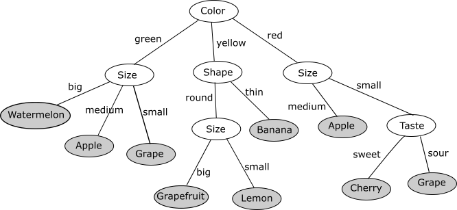
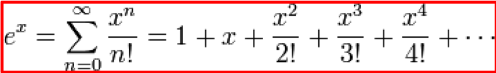
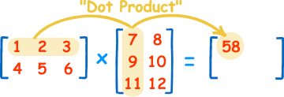

---
title: "TILEd Python exercises for first year programming courses"
author:  Tanja Vos
...

# TILEd Python exercises for first year programming courses
{:.no_toc} 

By [Tanja E.J. Vos](https://www.tanjavos.com).

- Table of contents
{:toc}

------------------------------------------------------------------------

Python exercises used at the UPV for first year programming courses that
have been adapted by using Test Informed Learning with Examples (TILE)
to integrate testing in programming education without it costing (much)
more time. The coloured boxes indicate how they were TILEd.

```testdomaintile
This colour box explains a TILE in the **test domain**.
```

```testruntile
This colour box explains a TILE related to **test runs** 
and/or **test cases**.
```

------------------------------------------------------------------------

# Variables, assignments, expressions, basic types {#section.var-assign-expr-types}

1.  Most of the programs that we implement:

    1.  obtain input data (for example through the keyboard),

    2.  do something with this data (for example perform some type of
        computation)

    3.  display the result as an output (for example on the screen).

    Sometimes the combination keyboard/screen is known by the name of
    the *console*, with which both are indistinctly identified.

    1\. Input data entry is carried out by using the instruction `input`
    such as in the following example:

    ```python
    n = int(input("Enter a number: "))
    ```

    Using this instruction we ask the user for a number through the
    keyboard. Obviously, this data will have to be stored somewhere in
    memory, that is, in a variable. The previous instruction indicates
    that the data entered by the user will be interpreted as an integer
    (`int`) and will be stored in the variable `n`.

    2\. Calculate the square of the given number is an example of a
    computation:

    ```python
    square = n * n
    ```

    The previous instruction calculates the square on `n` and stores the
    result in the variable `square`.

    3\. Displaying data is done by using the instruction `print` such as
    in the following example:

    ```python
    print("The square is", square)
    ```

    When we test this program by executing it in the console, we can
    obtain for example:

    ```
    >>> %Run 
      Enter a number: 5
      The square is 25
    ```

    Note that the program must work whatever has been the number entered
    by the user. When we write programs with which we can interact
    through the console, we can test our program by entering test input
    data through the keyboard en checking the resulting output on the
    screen. To test our program to see whether is also works for other
    numbers, we could execute the following tests through the console:

    ```
    >>> %Run 
    Enter a number: 0
    The square is 0
    >>> %Run 
    Enter a number: -6
    The square is 36
    >>> %Run 
    Enter a number: 1000000
    The square is 1000000000000
    ```

    ```testruntile
    UnTILEd this exercise said: When executing this program in the
    console, the user will give input through the keyboard en the
    results will be shown on the screen

    When we TILE the exercise, instead of just saying that we can
    execute programs through the console, we say we can *test* our
    program this way like we do above. This way we also introduce the
    students with the terminology:

    -   test your program

    -   test input

    -   checking the resulting output

    Then with sample executions we invite then to do more tests. And all
    of this in one of the very first exercises.
    ```

2.  Given two variables `a` and `b`, write a Python program that allows
    the user to enter two values for them, swap their values and display
    them on the screen. The execution of the program should result in
    the following:

    ```
    >>> %Run
      Enter the value of the variable a: 4
      Enter the value of the variable b: 2
      The value of a is 2
      The value of b is 4
    ```

    Assuming that 4 and 2 are the values entered by the user. This
    should work for any pair of user-entered values.

    Execute tests through the console and check the output. Does your
    program work for negative numbers? Does it work for strings? Does it
    work for characters? Does it work for reals? Can `a` and `b` have
    different types? Should your program work for all these cases?

    ```testruntile
    This exercise was TILEd by adding the last paragraph. We explicitly
    ask the students to test for different types of values. Most
    students, because of the example execution convert the user input to
    int, but that is not necessary for the swapping, anything can be
    swappped. Asking them to test with all kinds of values makes them
    aware of the assumptions they made when reading the exercises and
    hence how testing is good to find errors.
    ```

3.  Make a program in Python that receive values for three variables
    `a`, `b` and `c`, and interchange their values as follows:

    -   `b` takes the value of `a`,

    -   `c` takes the value of `a`, and

    -   `a` takes the value of `c`.

    This must be done WITHOUT using auxiliary variables, that is,
    additional helper variables that are not a, b or c, and are used to
    store some values.

    Execute tests through the console and check the output. Does your
    program work for negative numbers? Does it work for characters? Does
    it work for reals? Can `a`, `b` and `c` have different types? Should
    your program work for all these cases?

    ```testruntile
    This exercise was TILEd by adding the last paragraph. We explicitly
    ask the students to test for different types of values. Most
    students, because of the example execution convert the user input to
    int, but that is not necessary for the swapping, anything can be
    swappped. Asking them to test with all kinds of values makes them
    aware of the assumptions they made when reading the exercises and
    hence how testing is good to find errors.
    ```

4.  The expressions on the right of the assignment can be all complex
    that we want. Implement a program that reads two real numbers,
    calculates and prints their sum (`+`), subtraction (`-`), product
    (`*`) and division (`/`).

    ```
    >>> %Run 
      Enter a real number: 2.5
      Enter another real number: 34.903
      The sum is: 37.403
      The subtraction is: -32.403
      The product is: 87.2575
      The division is: 0.07162708076669627
    >>> %Run 
      Enter a real number: 0
      Enter another real number: 4
      The sum is: 4.0
      The subtraction is: -4.0
      The product is: 0.0
      The division is: 0.0
    >>> %Run 
      Enter a real number: 2000
      Enter another real number: 45.88
      The sum is: 2045.88
      The subtraction is: 1954.12
      The product is: 91760.0
      The division is: 43.59197907585004
    ```

    What happens when you test your programs with two zeros? Why does
    that happen? What could we do about that?

    ```testruntile
    TILEd by adding example test executions for them to test.
    ```

5.  Implement a program that reads two integer numbers, calculates and
    prints their addition, subtraction, product, division and modulus or
    remainder (`%`).

    ```
    >>> %Run 
      Enter a integer number: 4
      Enter another integer number: 6
      The sum (4 + 6) is:  10
      The subtraction (4 - 6) is:  -2
      The product (4 * 6) is:  24
      The division (4/6) is:  0.6666666666666666
      The modulus or remainder (4 % 6) is:  4
    >>> %Run 
      Enter a integer number: 0
      Enter another integer number: -100
      The sum (0 + -100) is:  -100
      The subtraction (0 - -100) is:  100
      The product (0 * -100) is:  0
      The division (0 / -100) is:  0
      The modulus or remainder (4 % -100) is:  0
    ```

    ```testruntile
    TILEd by adding example test executions for them to test.
    ```

6.  Implement a program that calculates the temperature in degrees
    Celsius from the temperature in degrees Fahrenheit. The formula is
    as follows: $$C = \frac{5}{9}(F-32)\;.$$ The input to the program is
    degrees Fahrenheit introduced by the user. We will save this value
    in a variable, for example `F`. Then, the program calculates the
    expression given by the formula and stores the result in another
    variable, for example `C`. The last step will consist of printing
    the result for the user.

    ```
    >>> %Run 
      Enter the degrees Fahrenheit: 84
      84.0 degrees Fahrenheit are 28.9 degrees Celsius
    ```

    Run more tests of your program and use the following online
    converter to check the outputs of your program:

    <https://www.metric-conversions.org/es/temperatura/fahrenheit-a-celsius.htm>

    ```testruntile
    We invite the student to test their program more and compare their
    outcomes with a parallel oracle that they can find on the web.
    ```

7.  Let us practice a bit with writing expressions. Implement a program
    that asks the user for two numbers, $$x$$ and $$y$$ and calculates the
    following:

    1.  $$x+y$$

    2.  $$(x+y)x$$

    3.  $$xx + yy$$

    4.  $$x^{5y}$$

    5.  $$3x^5-5x^3+2x-7$$

    6.  $$yx^5-(y+1)x^3+5x-y$$

    7.  $$x^{yy+2^y}$$

    Test your program (and your math skills) by:

    -   First doing he exercises by hand for $$x=4$$ and $$y=6$$ to obtain
        the expected outputs.

    -   Second, check the answers of your program with your expected
        outputs.

    ```testruntile
    We ask the students to do the calculations by hand such that they
    can use those to test their program. It makes them aware of the need
    for an oracle with which they need to check the outputs.
    ```

8.  Implement a program that calculates the interest produced from a
    total accumulated capital of an amount c, invested at an interest r
    (as a percentage) during t days. The formula used to calculate
    interest is:

    $$I=\frac{c \times r \times t}{360 \times 100}$$

    To test your program you can try with the following test cases:

      test case ID   inputs                  expected output
      -------------- -------- -------- ----- -----------------
                     $$c$$      $$r$$      $$t$$   
      1              10000    5.5%     360   550 euros
      2              25000    60%      45    1875 euros
      3              0        50%      200   0.0
      4              -2000    45%      2     -5.0
      5              12.345   56.78%   900   17.0

    ```testruntile
    Instead of sample executions for them to check, we add a table with
    test cases. This teaches them what test cases are made up of:

    -   identifier

    -   inputs

    -   expected outputs
    ```

9.  Copy and test the following program:

    ```python
    a = int(input("Enter a value for a = "))
           a = a + 1
           print("The value of the variable a is now ",a);
    ```

    As can be seen, the same variable can appear both as an operand and
    as an operator. This is a normal and widely used programming
    situation, so you should get used to it. Now replace the instruction
    *a = a + 1* by *a += 1*.

    ```testruntile
    This exercise would say: \"copy and execute the following program\",
    the change to \"copy and test the following program\" is a very
    subtle TILE.
    ```

10. Implement a program that calculates the gross and net salary of an
    employee. The program will request as data: the number of hours
    worked (nh), the price of the hour (ph) and the applicable
    withholding as a percentage (w). The gross (GS) and net (NS) salary
    is calculated as:

    1.  $$GS = nh * ph$$

    2.  $$NS = GS - (w/100*GS)$$

    ```
    >>> %Run 
      Enter the number of hours worked: 56
      Enter the price of the hour: 10
      Enter the applicable withholding in %: 25
      The gross salary is: 560.0
      The net salary is: 420.0
    ```

    To test your program you can try with the following test cases:

      test case ID   inputs                                expected output                   
      -------------- ----------- ----------------- ------- ----------------- --------------- --
                     $$nh$$        $$ph$$              $$w$$     gross salary      net salary      
      1              56 hours    10 euros/hour     25%     560 euros         420 euros       
      2              2.5 hours   20.4 euros/hour   25.6%   51.0 euros        37.944 euros    
      3              1 hour      25 euros/hour     0.1%    25.0 euros        24.975 euros    
      4              125 hours   20 euros/hour     0%      2500.0 euros      2500.00 euros   

    ```testruntile
    Add a table with test cases. Also added cases for values that are
    less obvious like 2.5 hours and 0.1%. So they test again their
    assumptions of the types of the variables.
    ```

11. Mad Libs is a phrase template word game where a player asks others
    for a list of words to substitute for blanks in a story, often
    comical or nonsensical, and which will be read aloud later. We are
    going to make a little Mad Libs.

    Look at the following example:

    

    We need to ask the player for the following words in English:

    -   verb, for example: `write`

    -   plural noun, for example: `problems`

    -   adjective, for example: `fun`

    So for these examples, our program returns:

    `Whether you write computer programs to solve problems or just for fun, it is very important that you ALWAYS TEST your code for bugs. `

    Try other inputs and try to come up with a funny phrase.

    ```testdomaintile
    This TILE contains the message that testing is important.
    ```

12. Suppose you need to test a program that takes two floats as input
    and produces a boolean as the result. A test case for this program
    consists of:

    -   an identifier

    -   two float type inputs

    -   an expected bool type output

    -   the result of the test test: "PASS" or "FAIL"

    Write a Python program that asks the user for the following data:

    -   an integer (`i`)

    -   two floats (`f1` and `f2`)

    -   a bool (`out`)

    -   a String (`result`)

    Your program must generate a string that uses the requested data and
    that describes the test case. For example, if:

    `i = 2`

    f1 = 123.456

    f2 = 12345.67

    out = True

    result = PASS

    your program should produce:

    `TEST_ID_002 --- inputs: 1.23e+02, 1.23e+04 --- output: True --- result: PASS`

    The first part of the string is used to classify test cases: it
    always has to start with `'test_ID_'` followed by an identifier of
    maximum 3 digits. If `i` has fewer digits then it must be filled
    with leading zeros.

    Floats must be presented in scientific format.

    You have to do 2 different implementations of your program. One
    using the String module operator % to format, and another with the
    `str.format()`.

    ```testdomaintile
    This exercise is about creating strings that have certain patterns
    using string manipulation. It used to be about file names, it was
    TILEd by making it about test cases and their components.
    ```

13. Implement a program that reads three integer values: day, month, and
    year of a person's birth. Using this data, the program should show a
    four-digit PIN associated with the date of birth. The PIN is
    calculated as:

    1.  p1 = (d1 + d2)% 10.

    2.  p2 = (m1 + m2)% 10.

    3.  p3 = (y1 + y4)% 10.

    4.  p4 = (y2 + y3)% 10.

    For example, if the date entered is 29 9 1975, the PIN would be 1 9
    6 6:

    1.  p1 = (2 + 9)% 10 = 1.

    2.  p2 = (0 + 9)% 10 = 9.

    3.  p3 = (1 + 5)% 10 = 6.

    4.  p4 = (9 + 7)% 10 = 6.

    ```
    >>> %Run 
      Enter your day of birth: 29
      Enter your month of birth: 9
      Enter your year of birth: 1975
      Your PIN is 1 9 6 6 
    ```

      test case ID   inputs                  expected output (PIN)
      -------------- -------- ------- ------ -----------------------
                     day      month   year   
      1              10       12      1522   1 3 7 2
      2              1        1       1      1 1 1 0
      3              27       3       1978   9 3 9 6
      4              55       28      300    0 0 0 3
      5              356      903     1568   1 3 9 1

    Look at test cases 4 and 5. Are they valid? Inputs 55 and 356 are
    not valid numbers for a day of birth. However, our program works and
    calculates a PIN. Python does not know what birthdays are and when
    they are valid. For Python the 3 inputs are simply whole numbers. If
    we want our program not to calculate a PIN when the date is not
    valid, then we should add conditions that verify the inputs. We will
    see how we can do it in the next thematic unit with decision
    statements like `if - then - else`.

    ```testruntile
    A table with test cases was added and the student were made aware of
    the test cases that not really contained valid dates but still
    calculated a PIN number.
    ```

14. Write a Python program that asks the user for something that seems
    important to him and returns the following ASCII art
    (<https://en.wikipedia.org/wiki/ASCII_art>):

    ```{frame="none"}
    >>> %Run
     Name something important: Testing your own code

                    \|||||/               
                    ( O O )                
    |---------ooO-----(_)-----------------|
    |                                     |
    | Testing your own code is important! |
    |                                     |
    |-------------------------Ooo---------|
                    |_||_|                 
                    ||  ||                 
                   ooO  Ooo                
    ```

    You can use the `len()` Python function that returns the length of a
    String (for example, `len("Python")` returns 6).

    Your program must work with any length name:

    ```{frame="none"}
    >>> %Run
     Name something important: Testing your program with all kinds of different input values

                                        \|||||/                                   
                                        ( O O )                                    
    |-----------------------------ooO-----(_)-------------------------------------|
    |                                                                             |
    | Testing your program with all kinds of different input values is important! |
    |                                                                             |
    |---------------------------------------------Ooo-----------------------------|
                                        |_||_|                                     
                                        ||  ||                                     
                                       ooO  Ooo                                                                               
    ```

    ```testdomaintile
    This TILE contains the message that testing is important.
    ```

15. We want to format a shopping list for a party with the following
    products: beer, wine and chips. You have to ask the user for the
    prices of the 3 products (we assume that they are always $$< 10$$
    euros), and the quantities they want to buy (we assume that they are
    always $$<100$$ units). The program must return the purchase itemized
    as follows:

    ```
    >>> %Run 
      Beer price? 9.99
      Wine price? 1.05
      Chips price? 4
      How much beer? 99
      How much wine? 23
      How many bags of chips? 1
      --------------------------
      Total purchase
      --------------------------
      Beer           99   989.01
      Wine           23    24.15
      Chips          01     4.00
                           -----
                  Total  1017.16
    ```

    You have to do 2 different implementations of your program. One
    using the String module operator % to format, and another with the
    `str.format()`. Test your program with different prices ($$<10$$
    euros) and quantities ($$<100$$ units) to test that the layout is
    always aligned.

    ```testruntile
    We added one sentence explicitly asking the students to test with
    some values and check the output.
    ```

# Conditionals: If-then-else {#section.if-then-else}

1.  Write a program that converts a number of seconds into days, hours,
    minutes, and seconds. The output of your program must have the
    layout as in the following examples:

    ```small

    >>> %Run 
      Enter a number of seconds: 184
      The equivalent duration is 0:00:03:04.
    >>> %Run 
      Enter a number of seconds: 6756456
      The equivalent duration is 78:04:47:36.
    >>> %Run 
      Enter a number of seconds: -2
      Only positive values
    ```

    To test your program, think about the inputs you want to use for the
    test cases and check the output by using the following converter:

    <https://www.convert-me.com/en/convert/time/second/second-to-dhms.html>

    In this way we are using another program to test the output of our
    program. The other program tells us what the expected results are,
    to compare them with the actual results of the program we are
    testing. In testing it is called an *oracle*.

    The term oracle derives from the Latin oraculum that means the
    answer of a divinity to the questions that are posed to them. In
    testing, the question we ask is: what are the expected outputs of
    this program? A test oracle can be an existing system, a user
    manual, the exercise description, or the specialist knowledge of the
    programmer, but it should not be the code.

    ```testruntile
    We invite the student to test their program more and compare their
    outcomes with a parallel oracle that they can find on the web.
    Moreover, we explain the terminology oracle.
    ```

2.  A bakery sells slices of bread for 3.49 euros each. A day old bread
    gets a discount of 60 percent. Write a program that asks the user
    for the number of day old loaves of bread they want to buy. Then
    your program should show the price of bread, the discount for being
    a day old and the total price. Each one of these amounts must be
    shown on their own line with a suitable label. Every values should
    be displayed using two decimal places, and decimal points in all
    numbers should line up when the user enters reasonable values.

    You have to test your program to see if it works well.

    ```small
    >>> %Run 
      Enter the number of day old loaves: 45
      -------------------------
      Regular price:     157.05
      Discount:           94.23
      -------------------------
      Total:              62.82

    >>> %Run 
      Enter the number of day old loaves: 0
      -------------------------
      Regular price:       0.00
      Discount:            0.00
      -------------------------
      Total:               0.00

    >>> %Run 
      Enter the number of day old loaves: -4
      You cannot buy negative amounts of bread
    ```

    ```testruntile
    Insist that the students test their programs by giving them example
    test executions.
    ```

3.  Write a Python program that asks the user for a word $$p$$ and it
    returns in the output another word in which the first and last
    characters of $$p$$ have been exchanged. Use the chain cutter
    operator. Run the following tests to test the operation of your
    program:

      test case ID   input       expected output
      -------------- ----------- -----------------
      1              `""`        `""`
      2              `"a"`       `"a"`
      3              `"ab"`      `"ba"`
      4              `"ab ba"`   `"ab ba"`

    ```testruntile
    Insist that the students test their programs by giving them a table
    of test cases.
    ```

4.  Write a program that reads an integer number and tells whether it is
    odd or even. Run the following examples to test that your program
    gives the same outputs:

    ```small
    >>> %Run 
      Enter an integer number: 1
      The number 1 is odd
    >>> %Run 
      Enter an integer number: 0
      The number 0 is even
    >>> %Run 
      Enter an integer number:111
      The number 1 is odd
    >>> %Run 
      Enter an integer number: 23
      The number 23 is odd
    >>> %Run 
      Enter an integer number: -34
      The number 0 is even
    >>> %Run 
      Enter an integer number: -11
      The number -11 is odd
    ```

    ```testruntile
    Insist that the students test their programs by giving them example
    test executions.
    ```

5.  Implement a program that reads three values and displays on the
    screen the maximum and the minimum. Run the following examples to
    test that your program gives the same outputs:

    ```small
    >>> %Run 
      Enter the first value: 3
      Enter the second value: 6
      Enter the third value: 8
      The maximum is 8 and the minimum is 3
    >>> %Run 
      Enter the first value: -4
      Enter the second value: 6
      Enter the third value: 12
      The maximum is 6 and the minimum is -4
    >>> %Run
      Enter the first value: 4.567
      Enter the second value: 9
      Enter the third value: 12.9
      The maximum is 9 and the minimum is 12.9
    >>> %Run 
      Enter the first value: a
      Enter the second value: c
      Enter the third value: h
      The maximum is h and the minimum is a
    >>> %Run 
      Enter the first value: hello
      Enter the second value: hola
      Enter the third value: bonjour
      The maximum is hola and the minimum is bonjour
    >>> %Run 
      Enter the first value: 4
      Enter the second value: oh!
      Enter the third value: 4.89
      The maximum is oh! and the minimum is 4
    ```

    ```testruntile
    Insist that the students test their programs by giving them example
    test executions. The values used in the example test executions will
    make then aware that the program was not only for numerical values
    but for any value.
    ```

6.  Implement a program that reads an integer corresponding to a month
    of the year and displays the name of the corresponding month. If the
    entered number does not belong to the range \[1, 12\], an error
    message will be displayed.

    ```small

    >>> %Run 
      Enter the number of the month: 5
      May
    >>> %Run 
      Enter the number of the month: 12
      December
    >>> %Run 
      Enter the number of the month: 13
      Error: enter a number between 1 y 12
    >>> %Run 
      Enter the number of the month: -3
      Error: enter a number between 1 and 12
    >>> %Run 
      Enter the number of the month: 0
      Error: enter a number between 1 and 12
    ```

    ```testruntile
    Insist that the students test their programs by giving them example
    test executions.
    ```

7.  Implement a program that reads two integer numbers and says if their
    product is positive, negative, or zero **without** doing the
    calculation.

    Run the following combinations of examples to test that your program
    produces the same outputs:

    -   the first number is 0,

    -   the second number is 0,

    -   both numbers are 0,

    -   both numbers are positive,

    -   both numbers are negative,

    -   the first number is negative and the second is positive,

    -   the first number is positive and the second is negative.

    ```small
    >>> %Run
      Enter the first integer number: 0
      Enter the second integer number: -1
      The product is zero
    >>> %Run 
      Enter the first integer number: 5
      Enter the second integer number: 0
      The product is zero
    >>> %Run 
      Enter the first integer number: 0
      Enter the second integer number: 0
      The product is zero
    >>> %Run 
      Enter the first integer number: 2
      Enter the second integer number: 7
      The product is positive
    >>> %Run 
      Enter the first integer number: -4
      Enter the second integer number: -7
      The product is positive
    >>> %Run 
      Enter the first integer number: -8
      Enter the second integer number: 3
      The product is negative
    >>> %Run 
      Enter the first integer number: 10
      Enter the second integer number: -6
      The product is negative
    ```

    ```testruntile
    Insist that the students test their programs by giving them example
    test executions. Also pointing out that this way we try out all
    possible combinations to test.
    ```

8.  Write a program that reads an age, and finds out if someone is in
    their babyhood, childhood, adolescence, initial adulthood, mature
    adulthood, or old age. Use the following approximate definitions:

    -   Babyhood starts at birth and ends at 2 years of age.

    -   Childhood ranges from 2 to 12 years of age The adolescence
        corresponds to the age ranging from 12 to 20 years.

    -   Initial adulthood ranges from 20 to 40 years of age.

    -   Mature adulthood begins at age 40 and ends at age 60.

    -   Old age goes from 60 years on wards.

    Run tests and ensure that each of the possible outputs has occurred
    at least once.

    ```testruntile
    Add minimal line saying the should test such that each possible
    output has occurred.
    ```

9.  The density (d) of a substance is defined as the amount of mass (m)
    it has per volume unit (v). Then:

    $$d = \frac{m}{v} \;\;\leftrightarrow\;\; m = d \times v \;\;\leftrightarrow\;\; v = \frac{m}{d}$$

    Write a program that asks the user what he wants to calculate
    (density, mass or volume), then asks for the necessary data and at
    the end prints the result on the screen.

    Run the following examples to test that your program gives the same
    outputs.

    ```small

    >>> %Run 
      What do you want to calculate? (d, m, v):d
      Mass: 45
      Volume: 67
      The density is:  0.6716417910447762
    >>> %Run 
      What do you want to calculate? (d, m, v):d
      Mass: 45
      Volume: 0
      Cannot be calculated
     >>> %Run 
      What do you want to calculate? (d, m, v):m
      Densidad: 34
      Volume: 67
      The mass is:  2278
    >>> %Run 
      What do you want to calculate? (d, m, v):m
      Densidad: 0
      Volume: 25
      The mass is:  0
    >>> %Run 
      What do you want to calculate? (d, m, v):v
      Densidad: 56
      Mass: 900
      The volume is: 16.071428571428573
    >>> %Run 
      What do you want to calculate? (d, m, v):v
      Densidad: 0
      Mass: 568
      The mass is
    >>> %Run 
      What do you want to calculate? (d, m, v): z
      Enter only d, m or v
    ```

    ```testruntile
    Insist that the students test their programs by giving them example
    test executions.
    ```

10. Implement a program that asks the user for a relational operator
    (`<, <=, >, >=, ==, !=`) and 2 values. Your program has to display
    on screen the result (`True` or `False`) of the given operation
    applied to the two values.

    You can design the layout of the input and output of your program as
    you want. Run the following test cases to test the operation of your
    program:

      test case ID   inputs                               expected output
      -------------- ---------- ------------ ------------ -----------------
                     operator   value1       value2       
      1              `<`        12           4            `False`
      2              `>`        100          40           `True`
      3              `==`       `"Hello!"`   40           `False`
      4              `!=`       100          `"Python"`   `True`
      5              `>=`       98.67        0.45         `True`
      6              `<=`       -100         40           `True`
      7              `<`        24           `"24K"`      `True`
      8              `>=`       `"email"`    `"correo"`   `True`

    ```testruntile
    Insist that the students test their programs by giving them example
    test cases in a table. Again the chosen values will make them aware
    that this is not only for numerical values.
    ```

11. Implement a program that reads three integer numbers: `a`, `b` and
    `c`. The program must indicate whether the numbers can represent the
    sides of a triangle. For this, each value must be less than the sum
    of the other two. If so, the program must indicate if it is a:

    -   scalene triangle (if all three sides are different),

    -   equilateral triangle (if all three sides are equal), or

    -   isosceles triangle (two equal sides and one different).

    This triangle challenge is well known. It was proposed by Jerry
    Weinberg[^1], a famous computer scientist, and described by Glenford
    Myers, who wrote the first book on software testing, the classic The
    Art of Software Testing[^2].

    Test your program with the set of test cases proposed below:

      test case ID   inputs               expected output
      -------------- -------- ----- ----- -----------------
                     `a`      `b`   `c`   
      1              1        50    50    Isosceles
      2              2        50    50    Isosceles
      3              99       50    50    Isosceles
      4              100      50    50    Not a Traingle
      5              50       50    50    Equilateral
      6              50       1     50    Isosceles
      7              50       2     50    Isosceles
      8              50       99    50    Isosceles
      9              50       100   50    Not a Triangle
      10             50       50    1     Isosceles
      11             50       50    2     Isosceles
      12             50       50    99    Isosceles
      13             50       50    100   Not a Triangle

    ```testruntile
    Insist that the students test their programs by giving them test
    cases. Also include a bit of anecdotal history on the triangle
    program and first book on software testing.
    ```

12. Read an amount of euros and display the minimum breakdown in bills
    and coins for that amount on the screen. This means that the minimum
    number of bills/coins must be returned. We assume that there are
    500, 200, 100, 50, 20, 10 and 5 bills, and 2 and 1 coins.

    Write a version of this program that shows the breakdown on the
    screen mentioning only the bills and coins we need.

    ```small

    >>> %Run 
      Enter an amount of euros: 434
      2 bills of 200
      1 bill of 20
      1 bill of 10
      2 coins of 2
    >>> %Run 
      Enter an amount of euros: 0
      There are no bills or coins
    >>> %Run 
      Enter an amount of euros: -35
      There are no bills or coins
    >>> %Run 
      Enter an amount of euros: 1
      1 coin of 1
    >>> %Run 
      Enter an amount of euros: 5
      1 bill of 5
    ```

    What other tests could you run to ensure that your program has the
    desired behaviour? Have you tried, for example, entering different
    amounts that return all the bills and coins at least once? For
    example:

    -   for quantity 2, a coin of 2 must be returned

    -   for quantity 10, a bill of 10 must be returned

    -   for quantity 20, ...

    -   etc.

    Have you tried, for example, entering different amounts to test
    whether your program returns the minimum number of correct
    combinations of bills and coins? For example:

    -   for quantity 6, a bill of 5 and a coin of 1 must be returned
        (and not for example 3 coins of 2)

    -   for quantity 12, a bill of 10 and a coin of 2 must be returned
        (and not for example two bills of 5 and two coins of 1)

    -   for quantity 24, ...

    -   etc.

    ```testruntile
    Insisting that the students test their programs and think about all
    possible combinations.
    ```

13. Implement a program that reads the duration in seconds of a phone
    call and determines the total amount to be paid. The business rule
    is: *if the call lasts less than 1 minute it costs 10 cents, and
    each additional minute from the first one costs 5 cents*.

    For example, if the call lasts 35 seconds, the cost will be 10
    cents. If it lasts 3 minutes and 40 seconds (that is, the user will
    enter the value 220), it will cost 20 cents: 10 cents for the first
    minute plus 5 cents for the next 2 minutes. The remaining 40 seconds
    are free.

    ```small

    >>> %Run 
      Enter the number of seconds the call has lasted: 0
      The call has a cost of 0 cents
    >>> %Run 
      Enter the number of seconds the call has lasted: 5
      The call has a cost of 10 cents
    >>> %Run 
      Enter the number of seconds the call has lasted: 59
      The call has a cost of 10 cents
    >>> %Run 
      Enter the number of seconds the call has lasted: 125
      The call has a cost of 15 cents
    >>> %Run 
      Enter the number of seconds the call has lasted: 200
      The call has a cost of 20 cents
    >>> %Run 
      Enter the number of seconds the call has lasted: -5
      Please enter a correct value
    ```

    What other tests have you run to ensure that your program has the
    desired behaviour?

    ```testruntile
    Insist that the students test their programs by giving them example
    test executions and ask them to think about more tests.
    ```

14. The water company is implementing a new billing system. For each
    house, the invoice is made as follows:

    1.  The first 50 litres are free.

    2.  Between 50 and 200 litres, each litre is charged at 0.10 euros.

    3.  From 200 litres on, each litre is charged at 0.30 euros.

    4.  The minimum fee is 6 euros, that is, if the amount to pay is
        less than 6 euros, then the payment will be 6 euros.

    Write a program that calculates the water consumption of a family in
    a month given the number of litres used.

    ```small

    >>> %Run 
      Enter the litres of water used: 0
      The expense is 6.00€
    >>> %Run 
      Enter the litres of water used: -500
      Please enter a correct value
    >>> %Run 
      Enter the litres of water used: 300
      The expense is 90.00€
    >>> %Run 
      Enter the litres of water used: 55
      The expense is 6.00€
    ```

    ```testruntile
    Insist that the students test their programs by giving them example
    test executions.
    ```

15. A book store gives discounts to its customers depending on whether
    the customer has the membership card and the price of the purchase
    made.

    -   below 10 euros no discount is applied to anyone

    -   between 10 and 20 euros, a 5% discount is applied when the
        customer has the membership card

    -   above 20 euros, a discount of 12% is applied when the customer
        has the membership card, and 6% where there is no card.

    Write a program that asks the user by keyboard how much the purchase
    is, and whether the customer is a member or not. Depending on these
    input data, the program has to show on the screen how much the
    customer has to pay for the purchase.

    Run the following test cases to ensure that the program works
    correctly:

      ID   abstract test case                                 expected result
      ---- -------------------------------------------------- -----------------
      1    member with purchase under 10 euros                discount 0%
      2    non-member with purchase below 10 euros            discount 0%
      3    member with purchase between 10 and 20 euros       discount 5%
      4    non-member with purchase between 10 and 20 euros   discount 0%
      5    member with purchase over 20 euros                 discount 12%
      6    non-member with purchase over 20 euros             discount 6%

    We call these test cases *abstract* because, in order to execute
    them, we first have to think of concrete values that meet the
    conditions of the test case.

    ```testruntile
    Insist that the students test their programs by giving them example
    test cases in a table. Also we introduce the concept of abstract vs
    concrete test cases.
    ```

16. Write a program that determines if an athlete is selected to run a
    marathon. To be selected, the qualifying times are:

    -   150 minutes for men under 40

    -   175 minutes for men over 40

    -   180 minutes for women

    The data to be entered are: sex (possible values: M, F), age and
    time. It is necessary to verify if the entered data have suitable
    values, and if not, indicate it and stop the program. When the data
    is correct, the program will display the message "Selected" or "Not
    selected".

    ```small

    >>> %Run 
      Sex M/F: Y
      Enter only the letters M or F
    >>> %Run 
      Sex M/F: F
      Age: -4
      Enter a correct age
    >>> %Run 
      Sex M/F: M
      Age: 14
      Time: -400
      Enter a correct time
    >>> %Run 
      Sex M/F: M
      Age: 14
      Time: 300
      Not selected
    >>> %Run 
      Sex M/F: M
      Age: 50
      Time: 170
      Selected
    ```

    What other tests do you have to run to ensure that you have tried
    all the possible combinations? (HINT: in the tests above we have
    never tested the outputs when the sex is `F`)

    ```testruntile
    Insist that the students test their programs by giving them example
    test executions. Add a comment on tests that might be missing and
    that they have to think about.
    ```

17. Write a Python program that determines the cost of a car insurance
    depending on: the age of the person to be insured, and the number of
    years this person has a driver's license, and the number of
    accidents the person has been involved in. The program will ask for
    these data (in that order) to be entered by keyboard, and will
    return the amount of insurance if possible, taking into account
    that:

    a)  The customer must be over 18 years of age to be able to insure.

    b)  The base amount is 300 euros.

    c)  200 euros are added if the license is less than 3 years old, 150
        euros are added between 3 (inclusive) and 5 years (not
        inclusive), or 100 euros are added between 5 and 10 years (both
        inclusive).

    d)  200 euros are added if the age of the customer is under 25 years
        old.

    e)  There is an additional charge depending on the number of
        accidents:

    ```center
    ```{#tabla:sencilla}
      Accidents   Charge (euros)
      ----------- ----------------
      1           50
      2           125
      3           225
      4           375
      5           575
      6 or more   Not insured
    ```

    [\[tabla:sencilla\]]{#tabla:sencilla label="tabla:sencilla"}
    ```

    ```small

    >>> %Run 
      Age: 10
      You have to be 18 or over to have car insurance.
    >>> %Run 
      Age: 18
      Years with license: 0
      Number of accidents: 0
      The amount of the insurance is:  700 €
    >>> %Run 
      Age: 30
      Years with license: 3
      Number of accidents: 1
      The amount of the insurance is:  500 €
    >>> %Run 
      Age: 20
      Years with license: -4
      Enter an appropriate number of years
    >>> %Run 
      Age: 20
      Years with license: 4
      Number of accidents: -7
      Enter a positive number
    ```

    What other tests have you run to ensure that your program has the
    desired behaviour?

    Have you tried ages that lead to different behaviours? Try with the
    test cases (`age \le 25`), (`age \ge 25`) and also when the age is
    exactly 25, a value located between the two behaviour intervals.

    Have you tested your program for all possible ranges of years that
    the user can have the license? For example, the test cases for the
    years intervals `[0, 3[`, `[3, 5[` and `[5, 10]`.

    Have you tested your program with all possible values for the number
    of accidents?

    And how about different combinations of the cases mentioned above?

    ```testruntile
    Insist that the students test their programs by giving them example
    test executions. Moreover, guide them through a thinking process of
    what else needs to be tested.
    ```

18. An expert system is a type of artificial intelligence program that
    uses a knowledge base and a set of rules to perform a task that a
    human expert could do. They help self-diagnose a problem by
    answering a series of questions. For example, many hardware and
    software companies offer online troubleshooting tools to help people
    solve simple technical problems before calling a human.

    Create a program that guides the user through the process of
    figuring out the type of fruit on hand. Use the following decision
    tree to build the system:

    

    ```small

    >>> %Run 
      Color (green/yellow/red): green
      Size (big/medium/small): big
      Watermelon
    >>> %Run 
      Color (green/yellow/red): yellow
      Shape (round/thin): round
      Size (big/small): big
      Grapefruit
    ```

    To test your program very well you should have a test case for each
    of the 9 fruits on the tree.

    ```testruntile
    Insist that the students test their programs by giving them example
    test executions and ask them to add more tests such that each
    possible inputs occurs once.
    ```

19. You want to create a Python program to calculate different areas. To
    do this, the program will present the option of area to be
    calculated. The possible options are:

    1.  Calculation of the area of a square: area = side\*\*2

    2.  Calculation of the area of a triangle: area = (base \* height)/2

    3.  Calculation of the area of a rectangle: area = side1 \* side2

    Once the option has been chosen, the necessary data will be
    requested and the corresponding result will be presented. In the
    event that the specified option was not correct, the phrase
    "incorrect value\" would be displayed on the screen.

    ```small

    >>> %Run 
      Area (square/triangle/rectangle): square
      Side: 3.56
      The area of the square is: 12.6736
    >>> %Run 
      Area (square/triangle/rectangle): triangle
      Base: 18
      Height: 4
      The area of the triangle is: 36.0
    >>> %Run 
      Area (square/triangle/rectangle): rectangle
      Side 1: 4.67
      Side 2: 9
      The area of the rectangle is: 42.03
    >>> %Run 
      Area (square/triangle/rectangle): hello
      Wrong value
    >>> %Run 
      Area (square/triangle/rectangle): square
      Side: -4
      Wrong value
    ```

    ```testruntile
    Insist that the students test their programs by giving them example
    test executions.
    ```

20. Write a Python program to determine the quadrant of the Cartesian
    plane given the (x, y) coordinates of a point.

    

    To test this program try to execute a test case for each one of the
    possible 9 outputs (i.e. the 4 different pieces of axis, the origin
    and the 4 different quadrants).

    ```testruntile
    Insist that the students test their programs by giving them hints on
    what to test to get all possible outputs.
    ```

21. Implement a Python program that asks the user for four inputs: a
    serial number, a day, a month, and a year of production date. First
    your program has to verify that the given day, month and year
    correspond to a correct date. If not, your program will notify that
    on the screen and it will stop. You can finish a program with the
    instruction `exit()`.

    If the date is correct, then you have to check if the serial number
    corresponds to the production date and print the result on the
    screen.

    The serial number has to be 8 numbers long (remember the use of the
    `len()` function), any number with another length is wrong.

    Then we should check whether the serial number is correct and inform
    the user. A serial number is correct when:

    1.  The first 4 digits of the number (n1, n2, n3 and n4) meet the
        following properties:

        1.  n1 = (d1 + d2)% 10.

        2.  n2 = (m1 + m2)% 10.

        3.  n3 = (y1 + y4)% 10.

        4.  n4 = (y2 + y3)% 10.

    2.  The sum of the last 4 digits of the number (n5, n6, n7 and n8)
        must be less than 25.

    What tests have you run to ensure that your program has the desired
    behaviour? Note that dates can be incorrect in many ways, make sure
    your program detects them all and stops when you enter:

    -   day that is $$\leq 0$$

    -   month that is $$\leq 0$$

    -   year that is $$< 0$$ (do we accept the year 0?)

    -   days $$>=31$$ for months that only have 30 days

    -   days $$>=32$$ for months that only have 31 days

    -   29th of February when it is not a leap year

    Then for correct dates, calculate some serial numbers by hand such
    that you can test the output of your program.

    ```testruntile
    Insist that the students test their programs by giving them hints on
    what to test.
    ```


# Loops {#section.loops}

1.  Write a program to calculate the sum of the integers between $$N$$ and
    $$M$$, where $$N$$ and $$M$$ are values entered by the user. `result` =
    $$\sum_{n = N}^{M} n$$


    >>> %Run 
      Enter a number: 0
      Enter a number: 3
      The sum from 0 to 3 is:  6
    >>> %Run 
      Enter a number: -5
      Enter a number: 3
      The sum from -5 to 3 is: -9
    >>> %Run 
      Enter a number: -8
      Enter a number: 8
      The sum from -8 to 8 is:  0
    >>> %Run 
      Enter a number: 4
      Enter a number: 4
      The sum from 4 to 4 is:  4
    ```

    ```testruntile
    Insist that the students test their programs by giving them example
    test executions.
    ```

2.  Implement a program to read 10 positive numbers and independently
    calculate the sum of the odd and even numbers. If a negative number
    is entered, the program will display an error message and ask for
    the number again.


    >>> %Run 
      Enter a number: 4
      Enter a number: 5
      Enter a number: 6
      Enter a number: 7
      Enter a number: 8
      Enter a number: 9
      Enter a number: 12
      Enter a number: -4
      Please enter only positive numbers
      Enter a number: 0
      Enter a number: 3
      Enter a number: 209
      Sum of the even numbers:  30
      Sum of the odd numbers:  233
    >>> %Run
      Enter a number: -4
      Please enter only positive numbers
      Enter a number: -0
      Enter a number: 4
      Enter a number: 4
      Enter a number: 5
      Enter a number: 5
      Enter a number: 6
      Enter a number: 6
      Enter a number: 7
      Enter a number: 7
      Enter a number: 8
      Sum of the even numbers:  28
      Sum of the odd numbers:  24
    >>> %Run 
      Enter a number: 2
      Enter a number: 4
      Enter a number: 6
      Enter a number: 8
      Enter a number: 0
      Enter a number: 16
      Enter a number: 18
      Enter a number: 20
      Enter a number: 36
      Enter a number: 90
      Sum of the even numbers:  200
      Sum of the odd numbers:  0
    ```

    ```testruntile
    Insist that the students test their programs by giving them example
    test executions.
    ```

3.  Implement a program that reads 12 real numbers and calculates the
    mean of the positive and negative numbers. Afterwards, the result
    must be displayed to a maximum of 4 decimal places. Run the
    following test cases to test your program:

      test   inputs                                                                  expected outputs   
      ------ ----------------------------------------------------------------------- ------------------ -----------
      case                                                                           mean of            mean of
      ID                                                                             positives          negatives
      1      1, 2, 3, 4, 5, 6, 7, 8, 9, 10, 11, 12                                   6.5                0
      2      -1, -2, -3, -4, -5, -6, -7, -8, -9, -10, -11, -12                       0                  -6.5
      3      0, 0, 0, 0, 0, 0, 0, 0, 0, 0, 0, 0                                      0                  0
      4      12.4, 21.005, -3.67, 4.43, 5.56, 4.2, 7, 8.3, -91.3, -1.0, 32.4, 12.1   11.9327            -31.99

    ```testruntile
    Insist that the students test their programs by giving them example
    test cases in a table. Series with only positive numbers, series
    with only negative numbers, all zeros, and mix of positive/negative.
    ```

4.  Write a program that receives an integer $$N$$ and generates all the
    multiples of 7 between 1 and $$N$$. Run the following test cases to
    test your program:

      test case ID   inputs   expected outputs                
      -------------- -------- ------------------------------- --
      1              0        there are no multiples of 7     
      2              3        there are no multiples of 7     
      3              -5       there are no multiples of 7     
      4              -15      -7, -14                         
      5              18       7, 14                           
      6              57       7, 14, 21, 28, 35, 42, 49, 56   

    ```testruntile
    Insist that the students test their programs by giving them example
    test cases in a table. Again the chosen values will make them aware
    that there program should also work for negative numbers.
    ```

5.  Modify the previous program so that it displays only those multiples
    of 7 between 1 and $$N$$ that are not divisible by 3. Execute the
    following test cases to test your program:

      test case ID   inputs   expected outputs                
      -------------- -------- ------------------------------- --
      1              0        there are no multiples of 7     
      2              3        there are no multiples of 7     
      3              -5       there are no multiples of 7     
      4              -65      -7, -14, -28, -35, -49, -56     
      5              18       7, 14                           
      6              77       7, 14, 28, 35, 49, 56, 70, 77   

    ```testruntile
    Insist that the students test their programs by giving them example
    test cases in a table.
    ```

6.  We have a total of 15 test cases of a Python program. From each test
    we run, we take note of the number of failures that finds. So at the
    end we have a set of 15 natural numbers: From $$n_1$$ to $$n_{15}$$.

    We are going to write a program that asks for these 15 natural
    numbers through the keyboard and determines:

    -   How many tests have not found any error, that is, 0.

    -   How many tests have found between 1 and 3 errors.

    -   How many have found more than 4 errors.

    In the execution example below you can see how your program should
    handle negative numbers.


    >>> %Run 
      Enter the number of bugs found by test 1: 3
      Enter the number of bugs found by test 2: 4
      Enter the number of bugs found by test 3: -5
      You cannot enter negative amounts.
      Enter the number of bugs found by test 3: 5
      Enter the number of bugs found by test 4: 6 
      Enter the number of bugs found by test 5: 7
      Enter the number of bugs found by test 6: 0
      Enter the number of bugs found by test 7: 0
      Enter the number of bugs found by test 8: 1
      Enter the number of bugs found by test 9: 2
      Enter the number of bugs found by test 10: 6
      Enter the number of bugs found by test 11: 1
      Enter the number of bugs found by test 12: 2
      Enter the number of bugs found by test 13: 0
      Enter the number of bugs found by test 14: 0
      Enter the number of bugs found by test 15: 2
      Number of tests that have found 0 errors:  4
      Number of tests that have found between 1 and 3 errors:  6
      Number of tests that have found more than 4 errors:  5
    ```

    ```testruntile
    Categorising series of inputs, where the inputs are related to test
    cases. Test cases can find errors!
    ```

7.  Implement a program that reads 12 real numbers and calculates the
    maximum. Run the following test cases to test your program:

      test ID   inputs                                                                  expected outputs
      --------- ----------------------------------------------------------------------- ------------------
      1         12.2, 6.0, 3.3, 4, 5, 6.5, 7, 8, 9, 3.3, 11, 12.2                       12.2
      2         -1, -2, -3, -4, -5, -6, -7, -8, -9, -10, -11, -12                       -1
      3         0, 0, 0, 0, 0, 0, 0, 0, 0, 0, 0, 0                                      0
      4         12.4, 21.005, -3.67, 4.43, 5.56, 4.2, 7, 8.3, -91.3, -1.0, 32.4, 12.1   32.4

    ```testruntile
    Insist that the students test their programs by giving them example
    test cases in a table.
    ```

8.  Write a program that reads the grades of the students of a certain
    subject until the user enters the word "exit". The exit of your
    program must write at the end the number of passed, the number of
    failed, and the average grade. Remember that a string can be
    converted to a float, by calling `float`. Test it:


    >>> s = "3.456"
    >>> float(s)
    3.456
    >>> s = "-3.456"
    >>> float(s)
    -3.456
    ```

    Some examples of program executions are below. There you can see how
    your program should handle negative numbers.


    >>> %Run 
      Enter a grade or 'exit': 3.5
      Enter a grade or 'exit': 0
      Enter a grade or 'exit': 10
      Enter a grade or 'exit': 9.99
      Enter a grade or 'exit': 5
      Enter a grade or 'exit': 6
      Enter a grade or 'exit': 8
      Enter a grade or 'exit': exit
      Passed: 5
      Failed: 2
      Average grade: 6.07
    >>> %Run 
      Enter a grade or 'exit': -4
      You cannot enter negative amounts.
      Enter a grade or 'exit': 4
      Enter a grade or 'exit': -6.4
      You cannot enter negative amounts.
      Enter a grade or 'exit': 0
      Enter a grade or 'exit': 3
      Enter a grade or 'exit': exit
      Passed: 0
      Failed: 3
      Average grade: 2.3333333333333335  
    ```

    ```testruntile
    Insist that the students test their programs by giving them example
    test executions.
    ```

9.  Write a program that reads the age (an integer) of a set of people.
    Data entry will end when a negative value is entered. Your program
    has to calculate and display on the screen:

    -   the average of the ages,

    -   the maximum and minimum age, and

    -   how many of them are people of working age, that is, their age
        is between 18 and 65 years old


    >>> %Run 
      Enter an age:50
      Enter an age:18
      Enter an age:0
      Enter an age:-2
      Average: 22.666666666666668
      Maximum age: 50
      Minimum age: 0
      People of working age: 2
    >>> %Run 
      Enter an age:12
      Enter an age:16
      Enter an age:90
      Enter an age:65
      Enter an age:18
      Enter an age:17
      Enter an age:19
      Enter an age:66
      Enter an age:64
      Enter an age:-5
      Average: 40.77777777777778
      Maximum age: 90
      Minimum age: 12
      People of working age: 4
    ```

    ```testruntile
    Insist that the students test their programs by giving them example
    test executions.
    ```

10. Write a program that finds the first value $$N$$ for which the sum
    $$0 + 1 + 2 + 3 + ... + N$$ exceeds a LIMIT value that is entered by
    keyboard. Run the following test cases to test your program:

      test ID   input   expected output
      --------- ------- -----------------
      1         0       1
      2         1       2
      3         25      7
      4         -5      0
      5         -450    0
      6         45      10

    ```testruntile
    Insist that the students test their programs by giving them example
    test cases in a table. We have explicitly added 0 and negative
    numbers to make sure these are tested.
    ```

11. A three-digit number is called an Armstrong number if the sum of the
    cube of its digits equals the number itself. For example, 153 is an
    Armstrong number because ($$1 ^ 3$$) + ($$5 ^ 3$$) + ($$3 ^ 3$$) = 153.
    Write all Armstrong numbers between 100 and 500.

    To test your program consider these numbers, which are the only
    Armstrong numbers:

    $$153=1^3+5^3+3^3$$

    $$370=3^3+7^3+0^3$$

    $$371=3^3+7^3+1^3$$

    $$407=4^3+0^3+7^3$$

    ```testruntile
    Insist that the students test their programs by giving them the
    expected outcome of their program.
    ```

12. Write a program to determine whether an integer is prime or not. A
    prime number is a natural number greater than 1 that has only two
    positive divisors: itself and 1. For example, the prime numbers less
    than 200 are: 2, 3, 5, 7, 11, 13, 17, 19, 23, 29, 31, 37, 41, 43,
    47, 53, 59, 61, 67, 71, 73, 79, 83, 89, 97, 101, 103, 107, 109, 113,
    127, 131, 137, 139, 149, 151, 157, 163, 167, 173, 179, 181, 191,
    193, 197, 199. You can use them as test cases for your program.

    Remember, you should not only tests whether primes are detected
    correctly. You should also test other numbers and check your program
    says they are not prime. Also try with negative numbers.

    ```testruntile
    Insist that the students test their programs by giving them ideas or
    pointers about the test data to use.
    ```

13. Implement a program that, given two integers, returns if one is a
    divisor of the other. To do this, you must detect which is the
    smallest. You cannot use the division or remainder operation. In
    your implementation you must also take into account negative numbers
    and 0 (all numbers are divisors of 0).

    For your program, perhaps the `abs()` function from the Python
    standard library is useful. The `abs()` function returns the
    absolute value of the given number. The absolute value of a number
    is the value regardless of its sign. Therefore, the absolute of 10
    is 10, and hte absolute of -10 is also 10.

    Test your program with the following outputs:


    >>> %Run 
      Enter an integer number: 0
      Enter another integer number: 0
      There are no divisors of 0
    >>> %Run 
      Enter an integer number: 0
      Enter another integer number: 2
      2 is a divisor of 0
    >>> %Run 
      Enter an integer number: 4
      Enter another integer number: 0
      4 is a divisor of 0
    >>> %Run 
      Enter an integer number: -5
      Enter another integer number: 0
      -5 is a divisor of 0
    >>> %Run 
      Enter an integer number: 0
      Enter another integer number: -6
      -6 is a divisor of 0
    >>> %Run 
      Enter an integer number: 25
      Enter another integer number: 5
      5 is a divisor of 25
    >>> %Run 
      Enter an integer number: 4
      Enter another integer number: 16
      4 is a divisor of 16
    >>> %Run 
      Enter an integer number: 3
      Enter another integer number: 17
      3 is not a divisor of 17
    >>> %Run 
      Enter an integer number: 17
      Enter another integer number: 4
      4 is not a divisor of 17
    ```

    ```testruntile
    Insist that the students test their programs by giving them example
    test executions. Note that the test cases have been chosen carefully
    to make sure we cover a lot of combinations and take 0 into account.
    ```

14. Write a program to calculate the quotient and remainder of the
    integer division of two positive integers, using only the
    subtraction operation.

    Test your program with the following outputs:


    >>> %Run 
      Enter a positive integer number: 0
      Enter another positive integer number: 4
      The quotient is 0
      The reminder is 0
    >>> %Run 
      Enter a positive integer number: 4
      Enter another positive integer number: 0
      It cannot be divided by 0
    >>> %Run 
      Enter a positive integer number: 25
      Enter another positive integer number: 25
      The quotient is 1
      The reminder is 0
    >>> %Run 
      Enter a positive integer number: 26
      Enter another positive integer number: 20
      The quotient is 1
      The reminder is 6
    >>> %Run 
      Enter a positive integer number: 20
      Enter another positive integer number: 26
      The quotient is 0
      The reminder is 20
    >>> %Run 
      Enter a positive integer number: -4
      Enter another positive integer number: 5
      Only positive integers
    >>> %Run 
      Enter a positive integer number: 10
      Enter another positive integer number: -4
      Only positive integers
    ```

    ```testruntile
    Insist that the students test their programs by giving them example
    test executions. Note that the test cases have been chosen carefully
    to make sure we cover a lot of combinations and take 0 into account.
    ```

# Defining and testing functions

Note that this section contains the first exercises where pytests are
used. This means that pytest needs to be explained in class.

1.  Write a function `is\_digit` which receives a character as a
    parameter and returns a boolean. The function will return `True`
    when the character is a digit from 0 to 9, otherwise it will return
    `False`).

    You can use the following test cases to test your function:

      test_case_ID   test_input   expected_output   reason for testing this
      -------------- ------------ ----------------- -----------------------------------
      1              `'0'`        `True`            smallest digit
      2              `'9'`        `True`            largest digit
      3              `'5'`        `True`            other digit
      4              `'12'`       `False`           it is not a digit between 0 and 9
      5              `'-2'`       `False`           negative digit
      6              `'hello'`    `False`           string

    In pytest these could be implemented like:

    ```small
    ```python
    \@pytest.mark.parametrize(\"test_case_ID, test_input,
    expected_output\",\[ (1, '0', True), #smallest digit (2, '9', True),
    #largest digit (3, '5', True), #other digit (4, '12', False), #it is
    not a digit between 0 and 9 (5, '-2', False), #negative digit (6,
    'hello', False), #string \] )

    def test_is_digit(test_case_ID, test_input, expected_output): assert
    is_digit(test_input) == expected_output, \"case
    0\".format(test_case_ID)
    ```

    ```testruntile
    Insist that the students test their programs by giving them example
    pytests. And make the connection to the tables with test cases they
    have seen before.
    ```

2.  Write a program that reads a character from the keyboard and
    determines with the function `is_digit` from the previous exercise
    if it is one of the digits from 0 to 9. Write the program in such a
    way that it can be used to read several different characters from
    the keyboard until the user writes the word end.


    >>> %Run 
      Write a character or 'end' to finish: 4
      4 is a digit from 0 to 9
      Write a character or 'end' to finish: 56
      56 is not a digit from 0 to 9
      Write a character or 'end' to finish: dfg
      dfg is not a digit from 0 to 9
      Write a character or 'end' to finish: 0
      0 is a digit from 0 to 9
      Write a character or 'end' to finish: end
    >>>    
    ```

    ```testruntile
    Insist that the students test their programs by giving them example
    test runs.
    ```

3.  Write a function `is_prime` which receives an integer as a parameter
    and returns a boolean. The function will return `True` when the
    number is a prime, otherwise it will return `False`).

    You can use the following pytest to test your function.

    ```python
    \@pytest.mark.parametrize(\"testcase, input, expected_output\",\[
    (1, 0, False), (2, 1, False), (3, 2, True), (4, 25, False), (5, 23,
    True), (6, 97, True) \] )

    def test_is_prime(testcase, input, expected_output): assert
    is_prime(input) == expected_output, \"case 0\".format(testcase)
    ```

    ```testruntile
    Insist that the students test their programs by giving them example
    pytests.
    ```

4.  Write a program that reads an integer number from the keyboard and
    determines with the function `is_prime` from the previous exercise
    if it is a prime number. Write the program in such a way that it can
    be used to read several different numbers from the keyboard until
    the user writes the word end. When the user types something that is
    not an integer, you have to indicate it and give him the opportunity
    to write a number again.

    You can test your program with the following tests:

    ```{frame="single" label="\\em ejemlos de test ejecuciones"}
    >>> %Run 
      Write an integer number, or 'end' to finish: end
    >>> %Run 
      Write an integer number, or 'end' to finish: 4
      4 it is not a prime number
      Write an integer number, or 'end' to finish: 97
      97 is a prime number
      Write an integer number, or 'end' to finish: -4
      -4 it is not a prime number
      Write an integer number, or 'end' to finish: hello?
      just integer numbers or 'end' to finish!
      Write an integer number, or 'end' to finish: x
      just integer numbers or 'end' to finish!
      Write an integer number, or 'end' to finish: end
    >>> 
    ```

    ```testruntile
    Insist that the students test their programs by giving them example
    test runs.
    ```

5.  Write a function `lower_to_upper` which receives as a parameter a
    lowercase `letter` and returns that same character, uppercase. To do
    this you must use the functions `chr` y `ord`. If the `letter` does
    not belong to the lowercase alphabet, it must be returned the same
    `letter`.

    Remember that:

    -   `chr`: returns the character corresponding to an integer within
        the ASCII table. The ASCII table is based on the international
        alphabet with all 26 letters. The first letter `'a'` esta en la
        posición 97, por eso `chr(97)` returns `'a'` and 25 characters
        later (i.e. 97 + 25 = 122) is the `chr(122)`, that returns
        `'z'`.

    -   `ord`: returns the integer value of a character in the ASCII
        table. Capital letters of the international alphabet range from
        `ord("A")`, that returns `65`, to `ord("Z")`, that returns `90`.

    This is the last time we give you the pytests that you can use to
    test your function. From now on you will have to do it yourself.

    ```python
    \@pytest.mark.parametrize(\"testcase, input, expected_output\",\[
    (1, 'a', 'A'), (2, 'z', 'Z'), (3, 'ñ', 'Ñ'), (4, '\*', '\*'), (5,
    'Q', 'Q'), (6, ' \] )

    def test_lower_to_upper(testcase, input, expected_output): assert
    lower_to_upper(input) == expected_output, \"case
    0\".format(testcase)
    ```

    ```testruntile
    Insist that the students test their programs by giving them example
    pytests.
    ```

6.  Write a function `factorial` that given a positive integer `n`
    calculates the factorial. Remember that the factorial of `n` is
    defined as the product of all positive integers from 1 (that is, the
    natural numbers) to `n`. For example:

    $$5! = 5\ x\ 4\ x\ 3\ x\ 2\ x\ 1$$

    Write pytests to test your implementation. Remember that $$0! = 1$$ y
    $$1! = 1$$.

    ```testruntile
    Insist that the students test their programs by adding a line
    telling them to do it.
    ```

7.  The exponential function $$e^x$$ can be defined as a series of powers.

    Taylor Series Development:

    

    For example, when $$x = 1$$: $$e =  \sum_{n=0}^{\infty} \frac{1}{n!}$$

    then:

    $$e = \frac{1}{0!} +  \frac{1}{1!} + \frac{1}{2!} +  \dots$$

    Write a function `my_exp` that receives the value of $$x$$ as a
    parameter and uses an iteration to calculate the $$n$$-th term of the
    series, and adding these terms obtains an approximation to the value
    of $$e^x$$. You can use your `factorial` function from the previous
    exercise.

    You can use `math.exp` as the expected result in your parameterized
    pytest cases (ie in your `@pytest.mark.parametrize` list). Remember
    to keep in mind that comparing floats for equality has rounding and
    precision problems. We can compare that the difference between what
    comes out of our function and the math.exp is less than, for
    example, $$10^{-7}$$.

    ```small
    ```python
    def test_my_exp(tc, input, expected_output): assert
    abs(my_exp(input) - expected_output)\<10\*\*-7, \"case
    0\".format(tc)
    ```

    ```testruntile
    Insist that the students test their programs by providing them a
    parallel oracle and a pytest on how to use it.
    ```

8.  Write a function to calculate the greatest common divisor (`gcd`) of
    its two parameters $$x$$ and $$y$$, which are integers and greater than
    1. Use Euclid's algorithm. Let $$x$$ e $$y$$ be the original values of
    the variables $$a$$ and $$b$$, the algorithm says:

    As long as a and b are not equal, change the greater of the two for
    the difference between the greater and the lesser. When they have
    the same value, that's the `gcd` of $$x$$ and $$y$$.

    Properties on which the Euclid algorithm is based:

    -   At the end of each iteration: `gcd`($$x$$, $$y$$)= `gcd`($$a$$, $$b$$)

    -   This property is a consequence of the mathematical property:

        -   `gcd`($$a$$, $$b$$) = `gcd`($$a - b$$, $$b$$) when $$a > b$$

        -   `gcd`($$a$$, $$b$$) = `gcd`($$a$$, $$b - a$$) when $$b > a$$

    -   When finally $$a = b$$, `gcd`($$x$$, $$y$$) = `gcd`($$a$$, $$b$$)

    Write pytests to test your implementation. If we read the
    description of the exercise well, we see that the function does not
    have to work for numbers that are not greater than 0.

    ```testruntile
    Insist that the students test their programs by adding a line
    telling them to do it and make sure they read well what the function
    is supposed to do.
    ```

9.  Write a function `gcd_3num` that calculates the greatest common
    divisor of more than 2 numbers. To do this, use the function `gcd`
    (greatest common divisor of 2 numbers).

    Write pytests to test your implementation.

    ```testruntile
    Insist that the students test their programs by adding a line
    telling them to do it.
    ```

10. Write a function that, given an integer $$N1$$, returns another
    integer $$N2$$ that is the result of removing the first and last digit
    of $$N1$$. Note: If $$N1$$ has 2 digits or only one, then $$N2$$ must
    be 0. Examples of test cases that you can automate with pytest are:

      testcase number   input ($$N1$$)   expected output ($$N2$$)
      ----------------- -------------- ------------------------
      1                 42635          263
      2                 23             0
      3                 5              0
      4                 0              0
      5                 -3456          -45

    ```testruntile
    Insist that the students test their programs by giving them a table
    of test cases.
    ```

11. Write a function that receives a number $$N$$ as a parameter and
    generates a string with the numbers: $$1, 1, 2,
    1, 2, 3, 1, 2, 3, 4, 1, 2, 3, 4, 5, . \-. . , 1, 2, 3, . . . , N$$

    Examples of test cases that you can automate with pytest are:

      testcase number   input ($$N$$)   expected output
      ----------------- ------------- -----------------------------------
      1                 4             \"1, 1, 2, 1, 2, 3, 1, 2, 3, 4\"@
      2                 1             \"1\"@
      3                 0             \"\"@
      4                 -3            \"-1, -1, -2, -1, -2, -3\"@

    ```testruntile
    Insist that the students test their programs by giving them a table
    of test cases.
    ```

12. Write a function that receives a password as a parameter and
    determines its complexity, according to these rules:

    -   A very weak password contains only numbers and is less than
        eight characters long.

    -   A weak password contains only letters and is less than eight
        characters long.

    -   A strong password contains letters and at least one number, and
        is at least eight characters long.

    -   A very strong password contains letters, numbers, and special
        characters and is at least eight characters long.

    -   Passwords that are not weak or strong are normal.

    Remember that in theory class we have seen the following predefined
    functions in Python:

    \- `isdigit`, to check if a string has digits.

    \- `isalpha` to check if a string only contains characters of the
    alphabet.

    To test your function well, how many test cases have you run? Have
    you thought about both lowercase and uppercase?

    ```testruntile
    Insist that the students test their programs by asking them
    questions on what would be good test cases.
    ```

# Lists

1.  Write a function that, given an integer $$n$$ greater than zero,
    returns a list of the multiples of 3 that exist between 3 and $$n$$.
    Write another function that, given an integer $$n$$ greater than zero,
    returns a list of the divisors of $$n$$. Test your functions with
    pytest, for example:

    ```python
    \@pytest.mark.parametrize('testcase, input, expected_output',\[ (1,
    10, \[3, 6, 9\]), (2, 0, \[\]), (3, 1, \[\]), (4, -5, \[\]), (5, 12,
    \[3, 6, 9, 12\]), (6, 3, \[3\]) \]) def
    test_multiples_of_3(testcase, input, expected_output): assert
    multiples_of_3(input)==expected_output, 'case 0'.format(testcase)

    \@pytest.mark.parametrize('testcase, input, expected_output',\[ (1,
    10, \[1, 2, 5, 10\]), (2, 18, \[1, 2, 3, 6, 9, 18\]), (3, 1, \[1\]),
    (4, -5, \[\]), (5, 12, \[1, 2, 3, 4, 6, 12\]), (6, 0, \[\]) \]) def
    test_divisors_of(testcase, input, expected_output): assert
    divisors_of(input)==expected_output, 'case 0'.format(testcase)
    ```

    Now, use these functions to write a `main` program that asks the
    user for a number greater than zero through the keyboard that
    returns the following:

    ```python
    >>> %Run 
      Type an integer greater than zero: 1
      There are no multiples of 3
    >>> %Run 
      Type an integer greater than zero: 2
      There are no multiples of 3
    >>> %Run 
      Type an integer greater than zero: 3
      multiple = 3, divisors of 3 = [1, 3]
    >>> %Run 
      Type an integer greater than zero: 12
      multiple = 3, divisors of 3 = [1, 3]
      multiple = 6, divisors of 6 = [1, 2, 3, 6]
      multiple = 9, divisors of 9 = [1, 3, 9]
      multiple = 12, divisors of 12 = [1, 2, 3, 4, 6, 12]
    >>> 
    ```

2.  Write a function (`dniLetter`) that, given a DNI number, returns the
    letter that corresponds to it. The algorithm to calculate the
    control letter of a DNI is the following:

    -   Find the remainder by dividing the number by 23

    -   The letter is obtained using the remainder as index of the
        following table:

           REMAINDER   0   1   2   3   4   5   6   7   8   9   10   11
          ----------- --- --- --- --- --- --- --- --- --- --- ---- ----
            LETTER     T   R   W   A   G   M   Y   F   P   D   X    B

           REMAINDER   12   13   14   15   16   17   18   19   20   21   22
          ----------- ---- ---- ---- ---- ---- ---- ---- ---- ---- ---- ----
            LETTER     N    J    Z    S    Q    V    H    L    C    K    E

    Complete the table with the number of rows you consider necessary to
    design your test set and run the automatic tests with pytest.\

      test case number   input   expected output
      ------------------ ------- -----------------
      1                  @       @
      2                          
      3                          
      4                          
      5                          
      6                          

3.  Design a function that given a text string, returns the numbers that
    appear in the string. For example, the string 'a 1, a 201, and 2
    ones' contains 3 numbers: 1, 201, and 2.

    ```{frame="single" label="\\em example of executions"}
    >>> nums_in_string("a 1, a 201 and 2 ones")
      3
    >>> nums_in_string("without numbers")
      0
    >>> nums_in_string("2345543")
      1
    ```

    Write pytests to test your function in an automated way.

4.  Implement a module with a `main` that reads a string representing a
    binary number from the keyboard. If any character in the string is
    different from 0 or 1, the program will warn the user that the
    entered string does not represent a binary number and will ask to
    read the string again. Finally, the `main` will display the decimal
    integer value of the entered binary number.

    In the `main` you must use 2 functions that you have to define, and
    test with pytest:

    -   `check_if_is_binariy` that given a text string, it returns
        `True` if the string is composed of only 0 and 1, and if it does
        not, it returns `False`.

    -   `convert` to convert a string in binary format (i.e. only 0
        and 1) to decimal format.

    What test cases would you run to test your main well? And for the 2
    functions? Implement the tests with pytest.

5.  Implement a function `fib(n)` that returns a list with the first `n`
    numbers of Fibonacci. If `n == 0`, the function must return the list
    `[1]`, if `n == 1`, the function must return the list `[1,1]`. When
    `n < 1`, then start with the list `[1,1]` and add the next Fibonacci
    number by adding the previous numbers in the list.

    For example by typing:

    ```python
    >>> print(fib(0))
      [1]
    >>> print(fib(1))
      [1, 1]
    >>> print(fib(2))
      [1, 1, 2]
    >>> print(fib(12))
      [1, 1, 2, 3, 5, 8, 13, 21, 34, 55, 89, 144, 233]
    ```

    Don't forget your pytests to automate the tests!

6.  Write a Python function `delete_negatives` that takes a list as an
    argument and returns the same list but without the negative
    elements.

    ```python
    >>> borrar_negativos([0,-1,-11,2,33,-100,5])
      [2, 33, 5]
    >>> borrar_negativos([-1,-11,-3])
      []
    >>> borrar_negativos([4,68,111])
      [4, 68, 111]
    ```

    Run more automated tests with pytest. Don't forget a test for the
    empty list and the list with 1 element.

7.  Write a function (`maxPos`) that, given a non-empty list, returns
    the position where its maximum value is found. Then complete the
    table below with the number of rows you see necessary to design your
    test set and run the automatic tests with pytest. This time it is
    not necessary to test the empty list, because the statement clearly
    says that your function only has to work for a non-empty list.\

      test case number   input   expected output
      ------------------ ------- -----------------
      1                  @       @
      2                          
      3                          
      \....                      

8.  Write a function that, given a list of words and a word, returns the
    number of times that word appears in the list. Then, complete the
    table with the number of rows that you see necessary to design your
    test set and run the automatic tests with pytest.\

      test case number   input   expected output
      ------------------ ------- -----------------
      1                  @       @
      2                          
      3                          
      \....                      

9.  Design a function (`mySplit`) that gets a string and returns a list
    of all its words in lowercase. The returned list must not contain
    repeating words. You can't use Python's default `split`. For
    example, with the string:

    ```python
    >>> mySplit('A phrase made up of words. Another phrase with other words.')
      ['a', 'phrase', 'made', 'up', 'of', 'words', 'another', 'with', 'other']
    >>> mySplit('Hi! Helloooo HI')
      ['hi', 'helloooo']
    ```

    To design your set of tests that you have to run automatically with
    pytest, think about these cases:

    -   the string is empty

    -   the string has punctuation marks, like `,;.:-¿?+*()!¡`

    -   the string ends with a point

    -   the string does not end with a point

    -   the string has numbers

    -   que the string has repeated words, but some are capitalized and
        some are not (for example: `'HEllo hello heLlo'`

    -   the string has more than 1 space between words

    -   etc.

10. Write a function that, given a list of numbers, returns another list
    without the odd numbers. Then complete the table with the number of
    rows you see necessary to design your test set and run the automatic
    tests with pytest.\

      test case number   input   expected output
      ------------------ ------- -----------------
      1                  @       @
      2                          
      3                          
      \....                      

11. Write a function that, given a list of numbers, returns another list
    without repeating elements. Then complete the table with the number
    of rows you see necessary to design your test set and run the
    automatic tests with pytest.\

      test case number   input   expected output
      ------------------ ------- -----------------
      1                  @       @
      2                          
      3                          
      \....                      

12. Write a module with three functions about matrices, and their
    pytests: `sum\_of\_diagonal`, `create\_matrix` and `multiply`.

    1\) The first function is (`sum\_of\_diagonal`) that, given a $$m$$
    matrix of integers, calculates the sum of the integers that are on
    the diagonal. Your function has to check that the matrix is square
    and does indeed have a diagonal to add. For example:

    $${\tt sum\_of\_diagonal}(
    \begin{bmatrix}
        1 & 2 & 3 & 4 \\
        2 & 4 & 6 & 1 \\
        0 & 5 & 8 & 2 \\
        2 & 9 & 6 & 3 \\
    \end{bmatrix})
     = 16$$, $$\;\;$$ $${\tt sum\_of\_diagonal}(
    \begin{bmatrix}
        1 & 5   \\
        3 & 4  \\
    \end{bmatrix})
     = 5$$

    Your function must pass the following tests:

    ```small
    ```python
    \@pytest.mark.parametrize(\"testcase, input, output\",\[ (1,
    \[\[1,2,3\],\[4,5,6\],\[7,8,9\]\], 15), (2,
    \[\[1,0,1\],\[1,1,0\],\[1,1,1\]\], 3), (3, \[\[2,0\],\[0,2\]\], 4),
    (4, \[\[2,0\],\[0,2,3\]\], \"the matrix is not square\"), (5, \[\],
    0)\]

    def test_sum_of_diagonal(testcase, input, output): assert
    sum_of_diagonal(input) == output, \"case 0\".format(testcase)
    ```

    2\) Next, we write a function (`create\_matrix`) that, given two
    numbers $$n$$ and $$m$$, returns a list that represents a matrix with
    $$n$$ rows and $$m$$ columns, all values being 0.

    $${\tt create\_matrix}(3,4) = 
    \begin{bmatrix}
        0 & 0 & 0 & 0 \\
        0 & 0 & 0 & 0 \\
        0 & 0 & 0 & 0 \\
    \end{bmatrix})$$

    Design a set of test cases and automate them with the pytest.

    3\) The third function is for (`multiply`). Given two matrices $$m_1$$
    and $$m_2$$, returns $$m_1 \times m_2$$. Remember[^3] that we can only
    multiply 2 matrices if the number of columns in the $$m_1$$ matrix is
    equal to the number of rows in the $$m_2$$ matrix.\
    

    Your function must pass the following tests:

    ```small
    ```python
    \@pytest.mark.parametrize(\"testcase, input1, input2, output\",\[
    (1, \[\[12,7,3\], \[4, 5,6\], \[7, 8,9\]\], \[\[5,8,1,2\],
    \[6,7,3,0\], \[4,5,9,1\]\], \[\[114, 160, 60, 27\], \[ 74, 97, 73,
    14\], \[119, 157, 112, 23\]\] ), (2, \[\[12,7,3, 0\], \[ 4,5,6,12\],
    \[ 6,7,8, 9\] \], \[\[8,5,8,1,2\], \[6,9,7,3,0\], \[4,5,9,1,0\],
    \[4,5,9,1,0\] \], \[\[150, 138, 172, 36, 24\], \[134, 155, 229, 37,
    8\], \[158, 178, 250, 44, 12\] \] ), (3, \[\], \[\], \[\] ),
    (4,\[\[\]\],\[\[\]\], \"they cannot be multiplied\" ), (5,
    \[\[\]\],\[\[\[\]\]\], \"they cannot be multiplied\" ), (6,
    \[\[\[\]\]\],\[\[\]\], \[\[\]\] ) \])

    def test_multiply(testcase, input1, input2, output): assert
    multiply(input1, input2) == output, \"case 0\".format(testcase)
    ```

# Text files

1.  Make an interactive program in Python that asks for the number of
    people to store, and from each one of them asks for the following
    data by keyboard: day, month and year of birth (integers) and name
    of the person (String). Then it must store it in a file called
    `"dates.txt"` with the following format:

    ```{frame="single" label="\\em dates.txt"}
    12 03 1996 | Hira Sadler
        16 05 1997 | Roman Connelly
        08 10 1976 | Alexandre Bullock
        04 03 2010 | Tracy Kendall
    ```

    The above file has resulted from the following interactive session:\

    ```{frame="single" label="\\em example with 4 people"}
    >>> %Run 
      Number of people to store: 4
      
      Give the data for person 1:
      Day: 12
      Month: 3
      Year: 1996
      Name: Hira Sadler
      
      Give the data for person 2:
      Day: 16
      Month: 5
      Year: 1997
      Name: Roman Connelly
      
      Give the data for person 3:
      Day: 8
      Month: 10
      Year: 1976
      Name: Alexandre Bullock
      
      Give the data for person 4:
      Day: 4
      Month: 3
      Year: 2010
      Name: Tracy Kendall
      
      The file "dates.txt" has been generated.
    >>>
    ```

2.  From the previous exercise, make a program that reads the file
    `"dates.txt"` and tells us how many people were born in May. In the
    example above, there is only one person who was born in May. To test
    your program well, make sure that you also test it with different
    files `"dates.txt"`:

    -   a file `"dates.txt"` which has no one born in May

    -   a file `"dates.txt"` which has more than one person born in May

3.  We have the following format for a text file:\

    ```{frame="single" label="\\em threegrades.txt"}
    23 2.5 3.0 1.1
        34 2.0 1.0 1.0
        17 1.0 1.0 1.1
        450 4.0 2.1 2.2
        55 4.0 4.0 2.0
    ```

    In each line we have:

    -   the student's file number, which is an integer

    -   the grade of the first partial, a real value

    -   the grade of the second partial, a real value

    -   the attendance grade, a real value

    Write a function `calculate\_notes` in Python that receives as a
    parameter the name of a text file that has the format as
    `tresnotas.txt`, and writes on the screen the total number of
    students and how many of them have passed. A student will be deemed
    to have passed when the sum of his three grades is greater than or
    equal to 5.\

    ```{frame="single" label="\\em example of calling the function calculate\\_grades"}
    >>> calculate_grades("threegrades.txt")
      number of students: 5
      number of students who have passed: 3
    >>> 
    ```

4.  [\[generate_files\]]{#generate_files label="generate_files"} Write a
    Python program that allows you to generate a certain number of files
    with a random number (between 1 and 10) of random real numbers
    (between 1.00 and 200.00). The numbers must be aligned to the right
    and with 2 decimal places. You can import `random` and use `randint`
    to randomly generate integers, and `uniform` to randomly generate
    real numbers.

    Your program:

    -   first it must ask the user for the number of files he wants to
        generate

    -   then it asks for the name to use as the base of the generated
        files. For example, if the user wants 5 files with base name
        `file`, the program will generate the files `file1.txt`,
        `file2.txt`, ..., `file5.txt`.

    For example:

    ```{frame="single" label="\\em interactive session example"}
    >>> %Run 
      How many files?: 4
      What is the base name?: file
    >>> 
    ```

    It can generate for example:

    +:---------------+:---------------+:---------------+:---------------+
    | `              | `              | `              | `              |
    | `` {frame="sin | `` {frame="sin | `` {frame="sin | `` {frame="sin |
    | gle" label="\\ | gle" label="\\ | gle" label="\\ | gle" label="\\ |
    | em file1.txt"} | em file2.txt"} | em file3.txt"} | em file4.txt"} |
    | 133.25         | 29.92          | 50.08          | 6.64           |
    |  159.93        |  199.44        |   59.34        |  136.33        |
    |  162.02        |  158.01        |  109.88        |   32.02        |
    |   23.26        | ```            |  153.48        |   56.16        |
    |  147.50        |                |  195.16        |   97.67        |
    | ```            |                |   51.95        |  160.56        |
    |                |                |   86.55        | ```            |
    |                |                |  153.28        |                |
    |                |                | ```            |                |
    +----------------+----------------+----------------+----------------+

5.  Write a function `calculate\_variance` in Python that receives the
    name of a file and reads a number of real numbers from this file,
    storing them in a list. Then it shows the variance of these data on
    the screen. The variance is calculated as the sum of the squared
    differences between each element in the list, v\[i\], and the mean,
    all divided by the number of elements (N):
    $$w = \frac{\sum_{i=1}{n} (x[i]-mean)^{2}}{N}$$

    For example, imagine we have:

    ```{frame="single" label="\\em numbers.txt"}
    6.64 
     136.33 
      32.02 
      56.16 
      97.67 
     160.56 
    ```

    ```{frame="single" label="\\em function call example"}
    >>> calculate_variance("numbers.txt")
      3035.443822222222
    ```

    To test your function we are going to use Exercise
    [\[generate_files\]](#generate_files){reference-type="ref"
    reference="generate_files"} to generate a number of files (eg 5
    files `numbers1.txt`, `numbers2.txt`, `numbers3.txt`, `numbers4.txt`
    and `numbers5.txt`).

    Then we go to
    <https://www.calculatorsoup.com/calculators/statistics/variance-calculator.php>
    to calculate the variance of the data in these 5 files. In this way
    we have the expected results of our function.

    Then finish the following pytest code to run your tests
    automatically:

    ```python
    import pytest

    \@pytest.mark.parametrize(\"testcase, f_input, expected_output\",\[
    (1, \"numbers1.txt\", 3713.1622346939), (2, \"numbers2.txt\", \...
    (3, (4, (5, \])

    def test_calculate_variance(testcase, f_input, expected_output):
    assert abs(calculate_variance(f_input) - expected_output) \<
    10\*\*-7 , \"case 0\".format(testcase)
    ```

    Remember to keep in mind that comparing floats for equality has
    rounding and precision problems. That is why we must compare that
    the difference between what comes out of our function and what we
    expect is less than, for example, $$10^{-7}$$.

6.  Implement a `calculate\_IVA` function in Python that receives a name
    from a text file (for example `data.txt`) where the prices without
    IVA of some items are found. Your function must read these prices,
    apply IVA (21 $$\%$$) to them and save the values with VAT in a file
    named `data_IVA.txt`. The data in `data_IVA.txt` must be aligned to
    the right and with 2 decimal places. In addition to generating the
    file, your function has to return the name of the generated file.

    For example: `calculate\_IVA("data1.txt")` returns the string
    `"data1_IVA.txt"` which is the name of the generated file:

    +:------------------------+:--------------+:------------------------+
    | ```{frame="single"     |               | ```{frame=             |
    | label="\\em data1.txt"} |               | "single" label="the exp |
    | 12.05                   |               | ected content of file"} |
    |   6.70                  |     generates | 14.58                   |
    | 123.10                  |               |    8.11                 |
    | 333.33                  |               |  148.95                 |
    |  25.50                  |               |  403.33                 |
    | 100                     |               |   30.86                 |
    |   9.95                  |               |  121.00                 |
    | ```                     |               |   12.04                 |
    |                         |               | ```                     |
    +-------------------------+---------------+-------------------------+

7.  To test a function like `calculate\_IVA`, which generates a file,
    you have to open the file it has generated to check that it has the
    content you expected. For example, if you used the file `data1.txt`
    as input, you would expect a file with name `data1_IVA.txt` that has
    the content as shown in the example above.

    Doing that manually is tedious. Imagine doing it for 10 data files,
    from `data1.txt` to `data10.txt`, that we can generate for example
    with the Exercise
    [\[generate_files\]](#generate_files){reference-type="ref"
    reference="generate_files"}. We would have to manually generate the
    10 files from `data1_IVA.txt` to `data10_IVA.txt`, with
    `calculate\_IVA`, and then open them one by one to check their
    content to see if it is what we expect.

    We can automate it with pytest. However, the output of the function
    is not just a value as we have seen so far. The output of the
    `calculate\_IVA` function is a file. So the expected output can also
    be a file, and the test simply compares that what comes out is equal
    to what we expect!

    For that, we must create 10 files only once where we define the
    expected outputs of our tests: from to . Then we create a pytest
    like the one below:

    ```python
    \@pytest.mark.parametrize(\"testcase, f_input,
    f_expected_output\",\[ (1, \"data1.txt\",
    \"expected_output_data1_IVA.txt\"), (2, \"data2.txt\",
    \"expected_output_data2_IVA.txt\"), (3, \"data3.txt\",
    \"expected_output_data3_IVA.txt\"), (4, \"data4.txt\",
    \"expected_output_data4_IVA.txt\"), (5, \"data5.txt\",
    \"expected_output_data5_IVA.txt\"), (6, \"data6.txt\",
    \"expected_output_data6_IVA.txt\"), (7, \"data7.txt\",
    \"expected_output_data7_IVA.txt\"), (8, \"data8.txt\",
    \"expected_output_data8_IVA.txt\"), (9, \"data9.txt\",
    \"expected_output_data9_IVA.txt\"), (10, \"data10.txt\",
    \"expected_output_data10_IVA.txt\"), \])

    def test_calculate_IVA(testcase, f_input, f_expected_output):

    f_output = calculate_IVA(f_input)

    assert (open(f_output).read() ==
    open(f_expected_output).read()), \"case 0\".format(testcase)
    ```

    NOTE: To compare the files we have used `read` because the size of
    the files that we are handling here is very small.

8.  Write Python code that prompts the user for a 4-character word and
    creates the following heart in a heart.txt file.\

            HART        HART
         HART HART  HART HART
        HART     HART     HART
        HART              HART
         HART            HART
          HART          HART
            HART      HART
              HART  HART
                 HART

# Dictionaries

1.  Write a program that stores in a variable the next dictionary:

    `{'Euro':'`€', 'Dollar':' `$', 'Yen':'` `'},`

    It should ask the user for a currency and display its symbol or a
    warning message if the currency is not in the dictionary.

    ```
    >>> %Run 
      Enter a currency: Euro
      €
    >>> %Run 
      Enter a currency: Dollar
      $
    >>> %Run 
      Enter a currency: Wow
      That currency is not in the dictionary
    ```

2.  Write a function called `text\_to\_dic` that receives a text as an
    argument. It must create and return a dictionary where the keys are
    the words in the text, and their values are the number of
    occurrences of each of these in the text.

    Use the function you just wrote to define a function called
    `file\_to\_dic` that receives the name of a text file and returns a
    dictionary where the keys are the words of the text in the file and
    its values the number of appearances of each of these in the text of
    the file.

    Don't forget your documentation and pytests. To facilitate the
    creation of your test cases, in Poliformat there is a `text.txt`
    file that contains the following dictionary:

    ```python
    'Es': 13, 'un': 52, 'hecho': 13, 'hace': 11, 'tiempo': 8, 'que': 23,
    'lector': 9, 'mira': 13, 'el': 11, 'de': 26, 'texto': 13, 'sitio':
    11, 'mientras': 9, 'que.': 3, 'contenido': 10, 'mira.': 10
    ```

    A histogram is a graphical representation of a variable in the form
    of bars, where the area of each bar is proportional to the frequency
    of the values represented. They are used to obtain a general \"first
    view\" or panorama of the distribution of the population, or of the
    sample, regarding a characteristic, quantitative and continuous
    (such as length or weight) (see
    <https://es.wikipedia.org/wiki/Histograma>).

    Write a function `ascii\_histogram` that receives as an argument a
    dictionary with keys of type string and values of type int, and
    returns an ASCII histogram that uses the Python output format. An
    example is below:

    ```python
    >>> ascii_histogram(file_to_dic("text.txt"))
                 Es +++++++++++++
                 un ++++++++++++++++++++++++++++++++++++++++++++++++++++
              hecho +++++++++++++
               hace +++++++++++
             tiempo ++++++++
                que +++++++++++++++++++++++
             lector +++++++++
               mira +++++++++++++
                 el +++++++++++
                 de ++++++++++++++++++++++++++
              texto +++++++++++++
              sitio +++++++++++
           mientras +++++++++
               que. +++
          contenido ++++++++++
              mira. ++++++++++
    ```

    Create a test case to test the function `ascii\_histogram` that
    returns as expected result:

    ```python
    >>> ascii_histogram(dic)
                  0 
                  1 +
                  2 ++
                  3 +++
                  4 ++++
                  5 +++++
                  6 ++++++
                  7 +++++
                  8 ++++
                  9 +++
                 10 ++
                 11 +
    ```

3.  Write a program that creates a dictionary that simulates a shopping
    cart. The program must ask for the item and its price, and add the
    pair to the dictionary, until the user decides to finish. Then, the
    shopping list and the total cost should be displayed, as in the
    following example:

    ```small
    ```python
    
    >>> %Run 
      Enter a product: beer
      Enter its price: 1.50
      
      Do you want to continue? (Y/N): Y
      Enter a product: wine
      Enter its price: 4.50
      
      Do you want to continue? (Y/N): Y
      Enter a product: seed pack
      Enter its price: 1.00
      
      Do you want to continue? (Y/N): Y
      Enter a product: fruit
      Enter its price: 8
      
      Do you want to continue? (Y/N): N
      
      Product        Price
      --------------------
      beer           1.50€
      wine           4.50€
      seed pack      1.00€
      fruit          8.00€
      --------------------
      Total         15.00€
    ```

    You can assume that the user only adds 1 sample of each product.
    Your tests can be run through the shell manually.

4.  In the Scrabble game, each letter has scores associated with them.
    The total score of a word is the sum of its letter scores. The most
    common letters are worth less points, while the less common letters
    are worth more points. We are going to use a dictionary that maps
    from letters to point values. The points associated with each letter
    are shown below:

    ```python
    points = \"A\": 1, \"B\": 3, \"C\": 3, \"D\": 2, \"E\": 1, \"F\": 4,
    \"G\": 2, \"H\": 4, \"I\": 1, \"J\": 2, \"K\": 5, \"L\": 1, \"M\":
    3, \"N\": 1, \"O\": 1, \"P\": 3, \"Q\": 10, \"R\": 1, \"S\": 1,
    \"T\": 1, \"U\": 1, \"V\": 4, \"W\": 4, \"X\": 8, \"Y\": 4, \"Z\":
    10
    ```

    Write a function that calculates and displays the Scrabble score for
    a given word. Use the dictionary to calculate the score.

    The Scrabble board includes some cells that multiply the value of a
    letter or the value of a whole word. We will ignore these squares in
    this exercise.

    Write pytests to test your function, for example for the following
    test cases:

      testcase number   input                  expected output
      ----------------- ---------------------- -----------------
      1                 `''`                   0
      2                 `'Hello!'`             8
      3                 `'zzz'`                30
      4                 `'Surprise'`           10
      5                 `'1234'`               0
      6                 `'And with spaces?'`   24

5.  In this exercise you must simulate 1000 rolls of two dice. First,
    write a function called `twoDice()`, which simulates throwing 2
    six-sided dice. Your function won't take any parameter and will
    return the total that was rolled on two dice as the only result.

    Then, write a main program that uses this function to simulate the
    rolling of two dice 1000 times. As your program runs, you have to
    count the number of times each total occurs and save it to a
    dictionary. Then it should display a table that summarizes this
    data.

    On the one hand you have to show the percentage expected by the
    probability theory for each total:

    ```python
    expected_probability = 2: 1/36, 3: 2/36, 4: 3/36, 5: 4/36, 6: 5/36,
    7: 6/36, 8: 5/36, 9: 4/36, 10: 3/36, 11: 2/36, 12: 1/36
    ```

    The frequency of each total as a percentage of the number of dice
    rolls made. The output is shown below.

        Total   Simulated Percentage     Expected Percentage
        ----------------------------------------------------
        6       14.20                    13.89
        8       13.70                    13.89
        3       5.50                     5.56
        7       18.00                    16.67
        2       2.40                     2.78
        10      8.00                     8.33
        5       10.70                    11.11
        9       11.50                    11.11
        11      6.30                     5.56
        4       7.40                     8.33
        12      2.30                     2.78

6.  Morse code is a coding scheme that uses hyphens and dots to
    represent digits and letters. In this exercise, we are going to
    write a program that uses a dictionary to store the mapping between
    these symbols and Morse code. Use a dot to represent a Morse dot,
    and a hyphens to represent a Morse hyphens. The mapping of
    characters to hyphens and dots is shown in the table below:

    

    First, you have to write a function that translates words written in
    capitalized English into Morse code. The function must ignore any
    characters in the word that are not listed in the table above.

    After testing the function well, you have to write a program called
    `main` that calls this function to translate a message that asks the
    user. The user's message can consist of more than one word separated
    by a space.

    For example, if you are a user, type the message `Hello, World`! and
    your program must return the following Morse code:

        .... . .-.. .-.. --- .-- --- .-. .-.. -..

7.  Write a program that allows you to manage the customer data of a
    company. This should be stored in a dictionary in which:

    -   the key of each client will be their NIF, and

    -   the value will be another dictionary with the customer's data
        (name, address, phone, email, VIP), where the customer will have
        the value True if is a VIP customer.

    The program should ask the user for an option from the following
    menu:

        (1) Add customer,
        (2) Delete customer,
        (3) Show client,
        (4) List all clients,
        (5) List VIP clients,
        (6) Finish.

    Depending on the option chosen, the program must to do the
    following:

    `(1)`

    :   Ask for the customer's data, create a dictionary with the that
        information and add it to the database. If a client with the
        same NIF already exists, a message must be displayed indicating
        it.

    `(2)`

    :   Ask for the customer's NIF and delete their data from the
        database. If a client with this same NIF does not exist, a
        message must be displayed indicating it.

    `(3)`

    :   Ask for the customer's NIF and show their data. If a client with
        this same NIF does not exist, a message must be displayed
        indicating it.

    `(4)`

    :   Show the list of all the clients in the database, with their NIF
        and name.

    `(5)`

    :   Show the list of the VIP clients from the database, with their
        NIF and name.

    `(6)`

    :   End the program.

    You have to test your program well manually, thinking for each
    option which would be good test cases to ensure quality testing. For
    example, you can do the following interactions:

    \-

    :   add a VIP client

    \-

    :   check that it has been added correctly, by using the options
        `(3)`, `(4)` and `(5)`

    \-

    :   add a non-VIP customer

    \-

    :   check that it has been added correctly, by using the options
        `(3)`, `(4)` and `(5)`

    \-

    :   try to add another client with the same NIF, and check that your
        program does not allow it by giving a message

    \-

    :   add 3 more clients (1 VIP and 2 non-VIP)

    \-

    :   try to delete a client that does not exist and check that your
        program shows the corresponding message

    \-

    :   remove a customer that exists

    \-

    :   check that it has been deleted correctly, by using the options
        `(3)`, `(4)` y `(5)`

    \-

    :   end the program with `(6)`

8.  The problem with the previous exercise is that each time the program
    is launched, the data would have to be entered again. To avoid this,
    we are going to create two new options that allow us to use files as
    backup copies of the data in the dictionary. The menu for the user
    with the options will be as shown below:

        (1) Add customer,
        (2) Delete customer,
        (3) Show client,
        (4) List all clients,
        (5) List VIP clients,
        (6) Save to file,
        (7) Read data from file,
        (8) Finish.

    The option `(6)` will store the data in a file. Selecting this
    option will save the current dictionary data in the customer.txt
    file in the following format:

    nif; name; address; telephone; email; vip for example:

        1234;Michael Myers;2704 Hickman Street;203-355-7551;mm@f.com;True
        2345;Marilyn Scott;2834 Washington Street;361-346-8703:ms@f.com:False

    The option `(7)` will do the opposite operation. It will read the
    data from the customer.txt file and store it in the dictionary
    (removing all previous data from the dictionary).

    Now, the option to terminate will be the `(8)`.

    To test your program, run the tests from the previous exercise, but
    before ending the program choose the option `(7)`. Then, open the
    saved file to check that the content matches the clients.

# Tuples and sets

1.  Write a `odd_sum` function that takes a list or tuple of numbers. It
    should return a two-element tuple, containing (respectively) the sum
    of the even-indexed numbers and the sum of the odd-numbered numbers.
    Example:

    ```{frame="single" label="\\em tests example"}
    >>> odd_even_sum([2,4,6,1,12,3,4])
      (24, 8)
    >>> odd_even_sum([0,2,4,6,1,12,3,4])
      (8, 24)
    >>> odd_even_sum((1,2,1,2,1,2))
      (3, 6)
    >>> odd_even_sum((2,1,2,1,2,1,2))
      (8, 3)
    >>> odd_even_sum(())
      (0, 0)
    >>> odd_even_sum([])
      (0, 0)
    ```

2.  `zip` is a function that is predefined in Python. It takes two or
    more sequences and intersperses them. The name of the function
    refers to a zipper, since it intersperses two rows of teeth.

    This example zips a string and a list:

    ```python
    >>> s = 'abc'
    >>> t = [0, 1, 2]
    >>> zip(s, t)
    <zip object at 0x7f7d0a9e7c48>
    ```

    The result is a **zip object** that contains pairs that can be
    iterated over. The most common use of `zip` is in a `for` loop:

    ```python
    >>> for pair in zip(s, t):
    ...     print(pair)
    ...
    ('a', 0)
    ('b', 1)
    ('c', 2)
    ```

    We are going to write a `my_zip` function that does not return a zip
    object, but directly the list with the tuples. You can assume that
    the two sequences it receives have the same number of elements:

    ```python
    >>> s = 'abc'
    >>> t = [0, 1, 2]
    >>> mi_zip(s,t)
    [('a', 0), ('b', 1), ('c', 2)]
    >>> s = (1,2,3)
    >>> t = [4,5,6]
    >>> mi_zip(s,t)
    [(1, 4), (2, 5), (3, 6)]
    ```

    Don't forget to test your function with pytests.

3.  Write a `tuple_inter` function that receives two sets. The function
    must return a tuple that contains the intersection of the two sets
    and the result of erasing the intersection in the first set.

    For example you can test your function with:

    ```python
    >>> firstSet  = {23, 42, 65, 57, 78, 83, 29}
    >>> secondSet = {57, 83, 29, 67, 73, 43, 48}

    >>> tuple_inter(firstSet, secondSet)
      ({57, 83, 29}, {65, 42, 78, 23})
    >>> tuple_inter(firstSet, firstSet)
      ({65, 83, 23, 57, 42, 29, 78}, set())
    >>> tuple_inter(set(), set())
      (set(), set())
    ```

4.  A common use of tuples is as records. And of course, displaying
    those records in a table is a standard thing for programs to do. In
    this exercise, we'll do a bit of both: reading a list of tuples and
    displaying them in table format for the user.

    Imagine that we organize a conference on testing and we know from
    each speaker her name and the time he needs to travel to the
    conference venue.

    ```python
    speakers = \[('Jeff', 'Offutt', 7.85), ('James', 'Bach', 3.626),
    ('Lisa', 'Crispin', 10.603) \]
    ```

    Write a `format_sort_records` function in Python that allows
    scheduling and returns the following table:

        James      Bach        3.63
        Jeff       Offutt      7.85
        Lisa       Crispin    10.60

    This trip planner does not need the level of precision that the
    entry provides; it is enough for us to have two digits after the
    decimal point. Also note that the last name is printed after the
    first name, followed by a decimal-aligned indication of how long
    each proponent will take to arrive in increasing order. Each name
    must be printed in a 10-character field, and the time must be
    printed in a 5-character field, with a padding space character
    between each of the columns.

5.  Write a function that receives a text string and says whether it
    only has unique characters or not. This function should return True
    if it has no repeating characters and False otherwise. Write a
    pytest using the following parameterization:

    ```python
    \@pytest.mark.parametrize('testcase, input, expected_output',\[ (1,
    'Hello', True), (2, 'HelloO', False), (3, ", True), (4, 'cC',
    False), (5, '0123', True), (6, '33&44', False), (7, '!+&/', True),
    (8, '!++&/', False), \])
    ```

6.  A famous syllogism says:

    All humans are mortal.

    Socrates is human.

    Therefore Socrates is mortal.

    In the following code, you will see multiple sets. The first
    contains all things (I know some are missing, but consider it
    complete for this problem). The second is a set of all people
    (assuming that the first set is really complete). The third contains
    everything that is mortal (again, assuming that is complete).

    ```python
    todas = \"Socrates\", \"Plato\", \"Eratosthenes\", \"Zeus\",
    \"Hera\", \"Athene\", \"Acropolis\", \"Cat\", \"Dog\" personas =
    \"Socrates\", \"Plato\", \"Eratosthenes\" mortales = \"Socrates\",
    \"Plato\", \"Eratosthenes\", \"Cat\", \"Dog\"
    ```

    Use the set operators and their methods to show that it is true
    that:

    a\) all humans are mortal,

    b\) Socrates is human and

    c\) Socrates is mortal.

    \(d\) there are mortal things that are not human, and

    \(e\) there are things that are not mortal.

7.  Write a program that generates three sets of numbers between 1 and
    1000:

    the first set consists of all numbers that are divisible by 3,

    the second consists of all numbers that are divisible by 7, and

    the third consists of all numbers that are divisible by 11.

    Then, produce sets of all numbers between 1 and 1000 that are

    \(a\) divisible by both 3, 7, and 11,

    \(b\) that are divisible by 3 and 7, but not by 11, and

    \(c\) that are neither divisible by 3, nor by 7, nor by 11.

8.  Write a `generate_eratosthenes` function that, using the Sieve of
    Eratosthenes [^4], obtains the prime numbers between 2 and 120. The
    algorithm is based on having in a set the numbers between 2 and 120,
    and then eliminate from that set the multiples of 2, then those of
    3, then those of 5, and so on. Pseudocode would be as can be seen
    below:

        Create a set and initialize it with the numbers between 2 and 120
        Initialize p to 2
        As long as p is between 2 and 120
            As long as p is not within the set
                increase p
            Initialize k to 2 * p
            As long as k is less than 120
                Eliminate k from the set
                Update k to k + p
            Increase p

    To test your function, you can compare the numbers you obtain with
    those that appear below:


# Metadata

| *Summary*                     | Python exercises used at the UPV for first year programming courses that have been adapted by using Test Informed Learning with Examples (TILE) to integrate testing in programming education without it costing (much) more time.  |
| *TILE aspects*                | Test domain, test cases and test run TILE-ing is applied. |
| *Topics*                      | CLI input, CLI output, variables, assignments, expressions, basic types, conditionals, loops, function, dictionaries, file in-/output, tuples, sets |
| *Technology used*             | Python, pytest |
| *Audience*                    | CS1 |
| *Programming learning goals*  | Basic programming concepts, datatypes, file in-/output. |
| *Testing learning goals*      | Unit testing techniques. |
| *Prerequisites*               | None. |
| *Variants*                    | Numerous options are possible, including porting to other programming languages. |    


[^1]: <https://en.wikipedia.org/wiki/Gerald_Weinberg>

[^2]: <https://onlinelibrary.wiley.com/doi/book/10.1002/9781119202486>

[^3]: [https://es.wikipedia.org/wiki/Multiplicación_de_matrices](https://es.wikipedia.org/wiki/Multiplicación_de_matrices)

[^4]: <https://en.wikipedia.org/wiki/Sieve_of_Eratosthenes>
