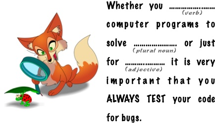

---
title: "MadLibs"
summary: "MadLib game with test related content."
prerequisites: "['io > standard > input', 'data > types (built-in) > primitive > numeric', 'imperative programming > variables > variable declaration', 'imperative programming > variables > assignment']"
concepts practised: "['data > types (built-in) > composite > sequences > strings']"
target audience: "CS1"
author: Tanja E.J. Vos
license: "CC-BY"
...

# MadLibs


Mad Libs is a phrase template word game where a player asks others
for a list of words to substitute for blanks in a story, often
comical or nonsensical, and which will be read aloud later. We are
going to make a little Mad Libs.

Look at the following example:



We need to ask the player for the following words in English:

-   verb, for example: `write`

-   plural noun, for example: `problems`

-   adjective, for example: `fun`

So for these examples, our program returns:

`Whether you write computer programs to solve problems or just for fun, it is very important that you ALWAYS TEST your code for bugs. `

Try other inputs and try to come up with a funny phrase.

```testdomaintile
This TILE contains the message that testing is important.
```
