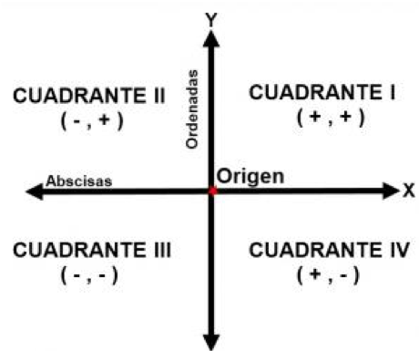

---
title: "Test Informed Learning with Examples assignment"
author: TILEd by Tanja E.J. Vos
...

# Determine the quadrant of the Cartesian plane


------------------------------------------------------------------------

Python exercises used for first year programming courses that
have been adapted by using Test Informed Learning with Examples (TILE)
to integrate testing in programming education without it costing (much)
more time. The coloured boxes indicate how they were TILEd.

```testdomaintile
This colour box explains a TILE in the test domain.
```

```testruntile
This colour box explains a TILE related to test runs 
and/or test cases.
```
------------------------------------------------------------------------

# Assignment

Write a Python program to determine the quadrant of the Cartesian
plane given the (x, y) coordinates of a point.



To test this program try to execute a test case for each one of the
possible 9 outputs (i.e. the 4 different pieces of axis, the origin
and the 4 different quadrants).

```testruntile
Insist that the students test their programs by giving them hints on
what to test to get all possible outputs.
```

# Metadata

| *Summary*                     | Determine the quadrant of the Cartesian plane based on a coordinate. |
| *TILE aspects*                | Test domain, test cases and test run TILE-ing is applied. |
| *Topics*                      | Determine the quadrant of the Cartesian plane. |
| *Technology used*             | Python |
| *Audience*                    | CS1 |
| *Programming learning goals*  | Conditional statements. |
| *Testing learning goals*      | Designing test cases for path coverage |
| *Prerequisites*               | Basic programming constructs. |
| *Variants*                    | Many options are possible, including porting to other programming languages. | 
| *Added by*                    | Tanja E.J. Vos |   

