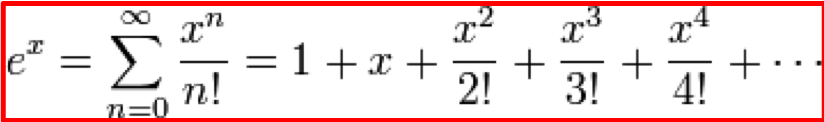

---
title: "Taylor series"
summary: "Taylor series."
prerequisites: "['io > standard > input', 'data > types (built-in) > primitive > numeric', 'imperative programming > variables']"
concepts practised: "['expressions > operators > arithmetic operators', 'control flow > loops']"
target audience: "CS1"
author: Tanja E.J. Vos
license: "CC-BY"
...


# Taylor series

The exponential function $$e^x$$ can be defined as a series of powers.

Taylor Series Development:



For example, when $$x = 1$$: $$e =  \sum_{n=0}^{\infty} \frac{1}{n!}$$

then:

$$e = \frac{1}{0!} +  \frac{1}{1!} + \frac{1}{2!} +  \dots$$

Write a function `my_exp` that receives the value of $$x$$ as a
parameter and uses an iteration to calculate the $$n$$-th term of the
series, and adding these terms obtains an approximation to the value
of $$e^x$$. You can use your `factorial` function from the previous
exercise.

You can use `math.exp` as the expected result in your parameterized
pytest cases (ie in your `@pytest.mark.parametrize` list). Remember
to keep in mind that comparing floats for equality has rounding and
precision problems. We can compare that the difference between what
comes out of our function and the math.exp is less than, for
example, $$10^{-7}$$.

```python
def test_my_exp(tc, input, expected_output): 
    assert abs(my_exp(input) - expected_output) < 10 ** -7, "case 0".format(tc)
```

```testruntile
Insist that the students test their programs by providing them a
parallel oracle and a pytest on how to use it.
```
