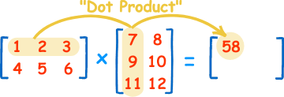

---
title: "Working with matrices"
summary: "Working with matrices."
prerequisites: "['io > standard > input', 'data > types (built-in) > primitive > numeric', 'imperative programming > variables']"
concepts practised: "['expressions > operators > arithmetic operators', 'control flow > loops', 'data > types (built-in) > composite > array']"
target audience: "CS1"
author: Tanja E.J. Vos
license: "CC-BY"
...

# Working with matrices

Write a module with three functions about matrices, and their pytests: `sum_of_diagonal`, `create_matrix` and `multiply`.

1\) The first function is (`sum_of_diagonal`) that, given a $$m$$
matrix of integers, calculates the sum of the integers that are on
the diagonal. Your function has to check that the matrix is square
and does indeed have a diagonal to add. For example:

$${\tt sum of diagonal}(
\begin{bmatrix}
    1 & 2 & 3 & 4 \\
    2 & 4 & 6 & 1 \\
    0 & 5 & 8 & 2 \\
    2 & 9 & 6 & 3 \\
\end{bmatrix})
    = 16$$, $$\;\;$$ $${\tt sum of diagonal}(
\begin{bmatrix}
    1 & 5   \\
    3 & 4  \\
\end{bmatrix})
    = 5$$

Your function must pass the following tests:

```python
@pytest.mark.parametrize("testcase, input, output",[ (1, [[1,2,3],[4,5,6],[7,8,9]], 15), (2, [[1,0,1],[1,1,0],[1,1,1]], 3), (3, [[2,0],[0,2]], 4), (4, [[2,0],[0,2,3]], "the matrix is not square"), (5, [], 0)]

def test_sum_of_diagonal(testcase, input, output): 
    assert sum_of_diagonal(input) == output, "case 0".format(testcase)
```

2\) Next, we write a function (`create_matrix`) that, given two
numbers $$n$$ and $$m$$, returns a list that represents a matrix with
$$n$$ rows and $$m$$ columns, all values being 0.

$${\tt create matrix}(3,4) = 
\begin{bmatrix}
    0 & 0 & 0 & 0 \\
    0 & 0 & 0 & 0 \\
    0 & 0 & 0 & 0 \\
\end{bmatrix})$$

Design a set of test cases and automate them with the pytest.

3\) The third function is for (`multiply`). Given two matrices $$m_1$$
and $$m_2$$, returns $$m_1 \times m_2$$. Remember[^3] that we can only
multiply 2 matrices if the number of columns in the $$m_1$$ matrix is
equal to the number of rows in the $$m_2$$ matrix.



Your function must pass the following tests:

```python
@pytest.mark.parametrize("testcase, input1, input2, output",[(1, [[12,7,3], [4, 5,6], [7, 8,9]], [[5,8,1,2],[6,7,3,0], [4,5,9,1]], [[114, 160, 60, 27], [ 74, 97, 73,14], [119, 157, 112, 23]] ), (2, [[12,7,3, 0], [ 4,5,6,12],[ 6,7,8, 9] ], [[8,5,8,1,2], [6,9,7,3,0], [4,5,9,1,0],[4,5,9,1,0] ], [[150, 138, 172, 36, 24], [134, 155, 229, 37,8], [158, 178, 250, 44, 12] ] ), (3, [], [], [] ),(4,[[]],[[]], "they cannot be multiplied" ), (5,[[]],[[[]]], "they cannot be multiplied" ), (6,[[[]]],[[]], [[]] ) ])

def test_multiply(testcase, input1, input2, output): 
    assert multiply(input1, input2) == output, "case 0".format(testcase)
```


[^3]: [https://es.wikipedia.org/wiki/Multiplicación_de_matrices](https://es.wikipedia.org/wiki/Multiplicación_de_matrices)