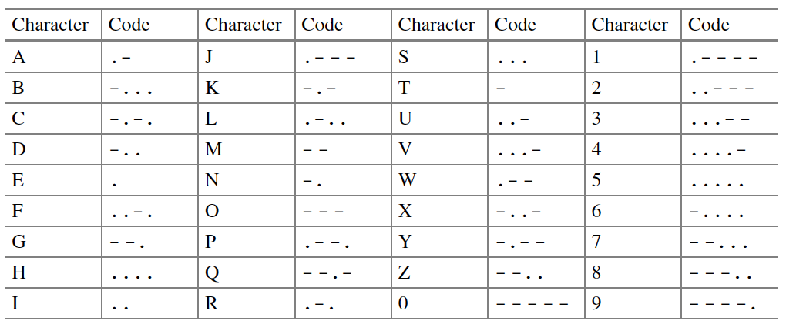

---
title: "Morse code converter"
author: TILEd by Tanja E.J. Vos
...

# Morse code converter

Morse code is a coding scheme that uses hyphens and dots to
represent digits and letters. In this exercise, we are going to
write a program that uses a dictionary to store the mapping between
these symbols and Morse code. Use a dot to represent a Morse dot,
and a hyphens to represent a Morse hyphens. The mapping of
characters to hyphens and dots is shown in the table below:

First, you have to write a function that translates words written in
capitalized English into Morse code. The function must ignore any
characters in the word that are not listed in the table above.

After testing the function well, you have to write a program called
`main` that calls this function to translate a message that asks the
user. The user's message can consist of more than one word separated
by a space.

For example, if you are a user, type the message `Hello, World`! and
your program must return the following Morse code:

    .... . .-.. .-.. --- .-- --- .-. .-.. -..

# Metadata

| *Summary*                     | Morse code converter |
| *TILE aspects*                | Test domain, test cases and test run TILE-ing is applied. |
| *Topics*                      |  |
| *Technology used*             | Python |
| *Audience*                    | CS1 |
| *Programming learning goals*  |  |
| *Testing learning goals*      |  |
| *Prerequisites*               | Basic programming constructs. |
| *Variants*                    | Many options are possible, including porting to other programming languages. | 
| *Added by*                    | Tanja E.J. Vos |   

