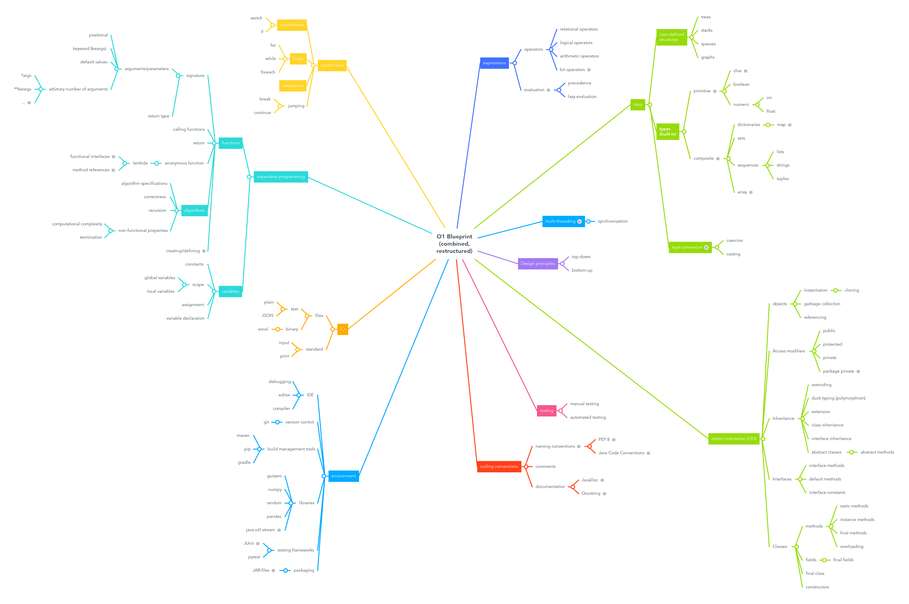

---
title: "The Blueprint"
...

# The Blueprint
The Blueprint is a hierarchical structure describing common concepts in programming languages. These concepts are used to describe the prerequisites of assignments and the concepts that can be practiced with the assignment. Below is a mind map of the blueprint and a textual representation.

# Textual representation

## Expressions

### Operators

- relational operators
- logical operators
- arithmetic operators
- bit operators

### Evaluation

- precedence
- lazy evaluation

## Data

### User-defined structures

- trees
- stacks
- queues
- graphs

### Type conversion

- coercion
- casting

### Types (built-in)

- primitive

	- char
	- boolean
	- numeric

		- int
		- float

- composite

	- dictionaries

		- map

	- sets
	- sequences

		- lists
		- strings
		- tuples

	- array

## Multi-threading

### Synchronization

## Design principles

### Top-down

### Bottom-up

## Object orientation (OO)

### Objects

- instantiation

	- cloning

- garbage collection
- referencing

### Access modifiers

- public
- protected
- private
- package private

### Inheritance

- overriding
- duck typing (polymorphism)
- extension
- class inheritance
- interface inheritance
- abstract classes

	- abstract methods

### Interfaces

- interface methods
- default methods
- interface constants

### Classes

- methods

	- static methods
	- instance methods
	- final methods
	- overloading

- fields

	- final fields

- final class
- constructors

## Testing

### Manual testing

### Automated testing

## Coding conventions

### Naming conventions

- PEP 8
- Java Code Conventions

### Comments

### Documentation

- JavaDoc
- Docstring

## environment

### IDE

- debugging
- editor
- compiler

### Version control

- git

### Build management tools

- maven
- pip
- gradle

### Libraries

- guizero
- numpy
- random
- pandas
- java.util.stream

### Testing frameworks

- JUnit
- pytest

### Packaging

- JAR-files

## IO

### Files

- text

	- plain
	- JSON

- binary

	- excel

### Standard

- input
- print

## Imperative programming

### Functions

- signature

	- arguments/parameters

		- positional
		- keyword (kwargs)
		- default values
		- arbitrary number of arguments

			- *args
			- **kwargs
			- ...

	- return type

- calling functions
- return
- anonymous function

	- lambda

		- functional interfaces
		- method references

- algorithms

	- algorithm specifications
	- correctness
	- recursion
	- non-functional properties

		- computational complexity
		- termination

- creating/defining

### Variables

- constants
- scope

	- global variables
	- local variables

- assignment
- variable declaration

## Control flow

### Conditionals

- switch
- if

### Loops

- for
- while
- foreach

### Exceptions

### Jumping

- break
- continue