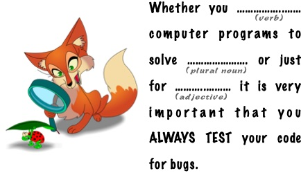

---
title: "Test Informed Learning with Examples"
...

# Test Informed Learning with Examples

## What is Test Informed Learning with Examples?

Test Informed Learning with Examples (TILE), is a new approach to introduce software testing in introductory and advanced programming courses in the following ways:

early 
:	introduce students to testing from the very first example program they see and write themselves in exercises;

seamless 
:	testing will be introduced in a smooth and continuous way as an inherent part of programming, and not as a separate activity;

subtle
:	we will make use of clever and indirect methods to teach them testing knowledge and skills.

## Background

Test Informed Learning with Examples was inspired by Test-driven learning (TDL). 
TDL was coined in 2006 by Janzen and Saiedian [^1]. 
It describes a pedagogical approach to teaching computer programming that involves introducing and exploring new programming concepts using examples and exercises that evolve around testing. 
When teaching programming many examples are being given, programming is often learned through examples. 
Examples related to testing take the same effort to present than other examples.
Janzen et. al. [^2] [^3] continued their work more in the direction of Test Driven Development (TDD) such they diverted from their initial TDL ideas. 
As a consequence, at this moment, there does not exist a clearly defined approach that can be used by any teacher to effortless introduce TDL in their programming course. 
To fill this gap, we developed TILE, Test Informed Learning with Examples.

## Types of TILES

We disthinghuish different types of TILES:

Test run TILES
:	When we show (or asks) our students what happens when we run (or execute) a piece of programming code, we can, with a minor change of the wording make a TILE out of the example. For example, we can ask the students to *test* the program, or ask them to *assert* the right output instead of asking them to *run* the program.

Test cases TILES
:	If we ask students to test their programs, they often only test happy path execution [^4] and hence do not really get that awareness we want about the importance of testing. A better way to TILE exercises would be to add more concrete examples of, or ideas about, possible *test cases* that the student should use to check the workings of their code. These example test cases should not just include the happy tests, but also make sure that their code is challenged on some corner cases and other less happy tests.

Test message TILES
:	TILES of this type hide a subliminal message about the importance of testing.

Test domain TILES
:	TILES of this type require a bit more creativity than the previous ones. In some programming exercises we use examples from a well known domain. For example, in explainations of Object Oriented Programming one might use the concept of shapes with classes such as `Rectangle` and `Circle` as a domain. If the domain does not influence the concepts we are teaching, then it can be replaced with examples from the testing domain directly.

## Some example assignments

Here we provide one assigments of each type of the approach.
The assignments have different levels of difficulty and cover different programming concepts.
They can be used in existing courses but are also created to show the possibilities of using TILE with existing assignment.
Eacht assignment end with some information about the testing aspects that are integrated in the assignment.

### A *test run* TILE assignment

Make a program that receive values for three variables `a`,
`b` and `c`, and interchange their values as follows:

-   `b` takes the value of `a`,
-   `c` takes the value of `a`, and
-   `a` takes the value of `c`.

This must be done WITHOUT using auxiliary variables, that is, additional
helper variables that are not a, b or c, and are used to store some
values.

The execution of the program should result in the following:

```
>>> %Run
  Enter the value of the variable a: 4
  Enter the value of the variable b: 2
  Enter the value of the variable c: 7
  The value of a is 7
  The value of b is 4
  The value of c is 4
```

Execute tests through the console and check the output. 
Does your program work for negative numbers? 
Does it work for characters? 
Does it work for reals? Can `a`, `b` and `c` have different types? 
Should your program work for all these cases?

<div class="howTILEd">
<strong>Test Informed Learning with Examples aspects</strong>
<p>
This exercise was TILEd by adding the last paragraph. 
We explicitly ask the students to test for different types of values. 
Most students, because of the example execution convert the user input to 'int', but that is not necessary for the swapping, anything can be swappped. 
Asking them to test with all kinds of values makes them aware of the assumptions they made when reading the exercises and hence how testing is good to find errors.
</p>
</div>

### A *test cases* TILE assignment

Implement a program that reads three integer values: day, month, and year of a person’s birth. 
Using this data, the program should show a four-digit PIN associated with the date of birth. 
The PIN is calculated as:

 - p1 = (d1 + d2) % 10.
 - p2 = (m1 + m2) % 10.
 - p3 = (y1 + y4) % 10.
 - p4 = (y2 + y3) % 10.

For example, if the date entered is 29 9 1975, the PIN would be 1 9 6 6:

 - p1 = (2 + 9) % 10 = 1.
 - p2 = (0 + 9) % 10 = 9.
 - p3 = (1 + 5) % 10 = 6.
 - p4 = (9 + 7) % 10 = 6.

```
>>> %Run 
  Enter your day of birth: 29
  Enter your month of birth: 9
  Enter your year of birth: 1975
  Your PIN is 1 9 6 6 
```

| test case ID | inputs |         |        | expected output (PIN) |
|:-------------|:-------|:--------|:-------|:----------------------|
|              | *day*  | *month* | *year* |                       |
| 1            | 10     | 12      | 1522   | 1 3 7 2               |
| 2            | 1      | 1       | 1      | 1 1 1 0               |
| 3            | 27     | 3       | 1978   | 9 3 9 6               |
| 4            | 55     | 28      | 300    | 0 0 0 3               |
| 5            | 356    | 903     | 1568   | 1 3 9 1               |

Look at test cases 4 and 5. 
Are they valid? Inputs 55 and 356 are not valid numbers for a day of birth. 
However, our program works and calculates a PIN. 
Our programming language does not know what birthdays are and when they are valid. 
For the programming language, the 3 inputs are simply whole numbers. 
If we want our program not to calculate a PIN when the date is not valid, then we should add conditions that verify the inputs. 

<div class="howTILEd">
<strong>Test Informed Learning with Examples aspects</strong>
<p>
A table with test cases was added and the students were made aware of the test cases that not really contained valid dates but still calculated a PIN number.
</p>
</div>

### A *test message* TILE assignment

Mad Libs is a phrase template word game where a player asks others for a list of words to substitute for blanks in a story, often comical or nonsensical, and which will be read aloud later. 
We are going to make a little Mad Libs.

Look at the following example:



We need to ask the player for the following words in English:

- verb, for example: `write`
- plural noun, for example: `problems`
- adjective, for example: `fun`

So for these examples, our program returns:

```Whether you write computer programs to solve problems or just for fun, it is very important that you ALWAYS TEST your code for bugs.```

Try other inputs and try to come up with a funny phrase.

<div class="howTILEd">
<strong>Test Informed Learning with Examples aspects</strong>
<p>
This TILE contains the message that testing is important.
</p>
</div>


### A *test domain* TILE assignment

Imagine you just wrote a program that sorts a list of numbers and evidently now you need to test it. Write a program that helps you test your software.
The program should ask you whether you took care of all the special cases and you answer yes or no.  At the end, the program tells you how well you did.  Below is an example of the output your program should produce. Try to extend the possible cases with other important things to test (there are at least two that are useful to add).

```
Hello! I'm gonna help you improve your sorting program!
  
Did you check a basic case like:
 [3, 1, 8] is sorted into [1, 3, 8]? (y/n) y
Excellent!
  
Did you check what happens when the list is empty? (y/n) y
Nice.
  
Did you check what happens for a list with a single
element, like [3]? (y/n) y
Well done!
  
Did you verify it also works with negative numbers, 
like [4, -8, 10]? (y/n) n
You’d better try that right now!
  
That was my last question! 
You took care of 75% of the cases. Well done!
```


## References

[^1]: [Test-driven learning: intrinsic integration of testing into the CS/SE curriculum](http://dl.acm.org/citation.cfm?id=1121419)
[^2]: [Test-driven learning in early programming courses](https://dl.acm.org/doi/10.1145/1352322.1352315) 
[^3]: [Implications of integrating test-driven development into CS1/CS2 curricula](https://dl.acm.org/doi/10.1145/1508865.1508921) 
[^4]: [Do student programmers all tend to write the same software tests?](https://dl.acm.org/doi/10.1145/2591708.2591757)
