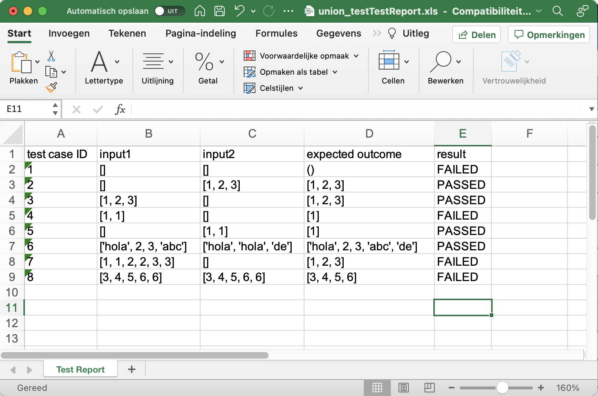

---
title: "Generating test reports using Test Informed Learning with Examples"
author: Niels Doorn, Tanja Vos, Beatriz Marín
...

# Generating test reports using Test Informed Learning with Examples
{:.no_toc}

By [Niels Doorn](mailto:niels.doorn@ou.nl), [Tanja Vos](mailto:tanja.vos@ou.nl) and [Beatriz Marín](mailto:bmarin@dsic.upv.es).

- Table of contents
{:toc}

## Introduction

This assignment is focussed on analysing files containing test cases to generate reports using a parser.
It purposely revolve around the testing domain.
This is one of the ways to apply the Test Informed Learning with Examples (TILE) approach to learn students about testing largely for free.
Students work on a assignment to learn certain programming concepts and meanwhile they are working with test related materials.

### Learning goals and prerequisites of the assignment

Programming learning goals:

-   Extract, Transform and Load (ETL) data using test files.
-   Processing Python, plain text, Excel and JSON files.
-   working with grammers and parsers, specifically Lark.

Testing learning goals (that are learned for free with TILE):

-   Remember how test outputs can be read/interpreted.
-   Remember how to parametrize tests with pytest.
-   Working with test cases and test results.

Prerequisites:

-   Understand parametrized tests with pytest[^2] and be able to run them and interpret the results.
-   Basic/primitive data types
-   Functions
-   Decision and control-flow structures
-   Arrays, lists, etc. (sequence types)

## Suggestions on how to use this assignment in the classroom

The focus of this assignment is to create reports of test cases and the results of these test cases.
Before students can do this, they need to distill information from both Python files containing pytest[^2] test cases and text files containing output from pytest.

The assigment address several interesing programming topics of which the most advanced topic is the application of a context free grammar using Lark[^1]. 
The concept of grammars and the usage of parsers can be a difficult and complex topic in CS programs. 
It helps if students discover the benefits of using parsers on their own to create an intrinsic motivation to dive into the application of a parser for a problem head first.

That is what we want to establish with this assignment. 
We provide three ["warmup" exercises](warmupexercises.md) of increasing complexity for the students. 
By letting students analyse test files in these exercises, we want them to experience the **limitations** of using the techniques they are familiar with such as conditional statements.
Either students themselves will at some point question the approach they follow when their code becomes unmaintainable, or lecturers can actively engage students and discuss the problems they will encounter if they continue with using if-then-else constructs or maybe regular expressions to support all possible test case constructs.
That is the moment to introduce them to a better way using the main assignment and the introduction of **parsers** and **grammars**.

We don't want to teach the students context free grammars in all their finesses, but we only want to introduce the students to the benefits and the application of parsers.
To support the students, we provide some information about [lark](lark.md) to get them started.
Depending on the prior knowledge and experience, it is possible to provide the students with the [grammer definition](files/grammar.lark) that can be used to parse test files.
This reduces the complexity considerably, and puts the focus on the application of the parser and less on understanding the grammar.

It is advisable at some point to introduce the concept of parsers and context free grammars to the student.
Depending on the educational setting and the background of the students, this can be done by one or more lectures or workshops, but it can also be done individually, in pairs or in small groups. A [tutorial](https://lark-parser.readthedocs.io/en/latest/json_tutorial.html) on parsing JSON using Lark can also be used by the students to get a good understanding of the features and the way to use Lark, but there are many general introductions to parsers and grammars available, such as this [introduction to Parsers](https://medium.com/@chetcorcos/introduction-to-parsers-644d1b5d7f3d).

The assignment can be simplified to focus mostly on the report generation by providing the students with the results of step one, the parsing of the test case.

## The assignment: generate a report combing test cases and test results 

Create a Python program to generating a test report in which the test cases and the results of the test run from pytest[^2] are combined. 
The output needs to be in Excel and in JSON. 

For example, using a set of pytests (e.g. in the file `test_union.py`), and a textfile `test_union_output.txt`) containing the output of those pytests, the final generated test report in Excel would be:



In JSON that will be something like:

TODO: Just put the JSON here as listing.

```json

```


The best way to approach this assignment is in three steps.

1. First we need to parse Python files containing test cases;
2. then we can combine those test cases with the test results which we store in a text file;
3. finally, we can generate the report.

### Step one: parse Python files containing test cases

Write a function `get_test_cases(filename)` in Python that generates a report with the test cases that are defined in a Python file containing pytests. For this part of the assignment, we use the Lark[^1] parser. Here is an [introduction](lark.md) to get started with Lark.

#### Grammar description

In this assignment we want Lark to parse files containing parameterized test cases for pytest[^2].

Test case lines look like this: 

```python
(num, i1, i2,...,in o),   #any type of comments
```

Each test case:

- starts with (
- ends with ),
- the first argument is a number, the ID of the test case
- after the end test case ), commenst starting with #can be discarded
- different parts of the test case are separated by ", "
- i1, i2, ..., in and o can be of any Python type (int, float, bool, strings, lists, tuples, variables, sets)

To reduce complexity, we assume there are no operators (unary, binary operators), variable names, dictionaries or function calls.

#### Example of analysing a test file

The file [pytest_file_to_test_parser.py](files/pytest_file_to_test_parser.py) contains a dummy function and test cases with all the by the grammar supported elements. 

It is listed here:

```python

```

If we analyse the test cases in this file, we can, for example, generate the following output:

```python
>>> get_test_cases("pytest_file_to_test_parser.py")
using pytest_file_to_test_parser.py
testcase: (1, {2, 3, 4.2, 4, 6.5, 5}, [2, 3, 4], (3, 4, 5), 'OK!')
testcase: (2, [], set(), (), 'this')
testcase: (3, True, 4.5, (3, 4), 'hoi')
testcase: (4, {5}, set(), '3.555', '3.67')
testcase: (5, {4}, {4}, [2, 2, 3, 4, 3, 5, 4, 3], '{2,4,7}')
testcase: (6, '', None, '', {2, 4, 7})
```

### Step two: process the output of the test cases

TODO

### Step three: generate the report

TODO

## Possible solution

This is a possible solution that can be used as a reference (intended only for the lecturer):

```python

```

## Files to use for this assignment

The following files can be used as input for the warm up exercises:

- [filter_odd_tests-test.py](files/filter_odd_tests-test.py)
- [filter_odd_tests-nocomments.py](files/filter_odd_tests-nocomments.py)
- [filter_odd_tests-YEScomments.py](files/filter_odd_tests-YEScomments.py)
- [filter_odd_tests-string-cases.py](files/filter_odd_tests-string-cases.py)
- [intersection_test.py](files/intersection_test.py)
- [min_max_list_test.py](files/min_max_list_test.py)
- [union_test.py](files/union_test.py)

Here is a file to use as input for the main assignment:

- [pytest_file_to_test_parser.py](files/pytest_file_to_test_parser.py)
  
The possible solution (for lecturers only) and it's output:

- [get_test_cases.py](files/get_test_cases.py)
- [output.txt](files/output.txt)

The Lark grammer can be provided to the students as a seperate file:

- [grammar.lark](files/grammar.lark)

## Known limitations of the assignment and the provided solution

There are many possible and advanced test cases that can be constructed using pytest.
Since the aim of this assignment is to understand the usefullness of applying a parser and not a complete course in compiler building or formal languages, it goed beyond the scope of this assignment to create complete support for all possible test cases. 
In fact, to do so, a parser for the Python language itself would have to be created (which is possible in Lark).
To keep the focus of the assignment generating reports and not only on the application of parser, the grammar should only support for the basic datatypes: int, float, bool, strings, lists, tuples, variables and sets and not for operators (unary, binary), variable names, dictionaries and function calls.

## Conclusion

With this assignment we can teach students about parsing using context free grammar parsers using python files containing tests.
By using this approach, student both learn advanced and useful programming techniques whilst they also revisit their prior knowledge about pytest and test cases. 
The main focus is on the handling of information about and from these test cases to generate reports.
One of the main programming learning goals is to learn the application of parsers and not so much on the theory of formal languages. 
The context free grammer parser Lark is used for this.
We provide exercises and suggestions on a didactic approach to use this assignment in the classroom.
The assignment can be adapted to reduce or increase complexity or to incorporate other learning goals such as the generation of files in various formats.
To make the assignment complete, we also provide a possible solution and input- and output files.

## Metadata

| *Summary*      | Test Informed Learning with Examples (TILE), is a new approach to introduce software testing in introductory and advanced programming courses in the following ways: *early* - introduce students to testing from the very first example program they see and write themselves in exercises; *seamless* - testing will be introduced in a smooth and continuous way as an inherent part of programming, and not as a separate activity; *subtle* - we will make use of clever and indirect methods to teach them testing knowledge and skills. This is a TILE based programming assignment that applies general applicable programming techniques such as file handling, parsing and data processing using a context related to testing. This way, students are not only learning those programming concepts, but they are learning testing concepts as well without the need to spend extra time. |
| *Topics*       | Testing, programming, file handling, data processing, parsing, generatin reports. |
| *Audience*     | This assignment is appropriate for CS2 students. The TILE method itself can very well be used in CS1 assignments. |
| *Difficulty*   | These are assignments for computer science students who completed a CS1 or similair course. |
| *Strengths*    | TILE offers the potential of teaching testing "for free" and as early as possible without adding any additional strain on the course schedule. |
| *Weaknesses*   | Whilst the teaching doesn't put strain on the course schedule itself, this approach does require effort to change existing course material in order to apply the method. We aim to reduce this effort by providing an open databank[^3] with TILED assignments. |
| *Dependencies* | This approach integrates into existing programming courses. The assignment presented here requires knowledge of basic programming concepts such as conditional statements, datatypes and artithmetic operations as well as more advanced topics such as using Python modules and the `pytest` tool. |
| *Variants*     | This assignment can be adapted in many ways, it can also be ported to other programming languages. The parser can be improved to support a more elaborate grammer. The report part can be alter to generate files of different types, for example pdf documents. This assignment can also be used to introduce students to compilers in general or to a course on compiler building. |

# References

[^1]: [Lark homepage](https://lark-parser.readthedocs.io)
[^2]: [Pytest homepage](https://docs.pytest.org/en/6.2.x/contents.html)
[^3]: [TILE Repository](https://tile-repository.github.io/)